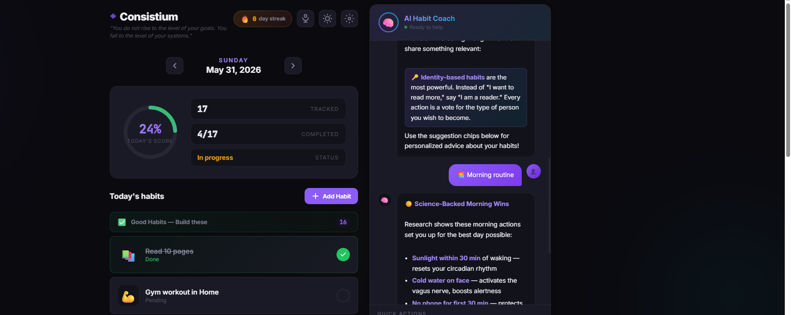

<div align="center">
  
  
  # ◆ Consistium

  <p align="center">
    <strong>Atomic Habit Tracker</strong>
  </p>
  
  <p align="center">
    <a href="#-features">Features</a> •
    <a href="#-getting-started">Getting Started</a> •
    <a href="#-gallery">Gallery</a> •
    <a href="#-devsecops--architecture">Architecture</a>
  </p>

  <p align="center">
    
    
    
    
    
    
  </p>
</div>

<br/>

> *"You do not rise to the level of your goals. You fall to the level of your systems."* — James Clear

**Consistium** is a premium daily habit tracker inspired by James Clear's *Atomic Habits*. Track your habits, build streaks, and become 1% better every day. It features a frictionless UI, motivational elements, and production-grade DevOps deployment capabilities.

<p align="center">
  
</p>

---

## ✨ Features

### 🎯 Habit Tracking
- **Daily Habits** — Tap to mark habits complete with satisfying micro-animations.
- **Good vs. Bad Habits** — Build positive routines or track habits you're trying to break. 
  - *Bad habits use reverse logic: they are marked as "Resisted ✓" by default and only "Slipped ✗" if checked.*
- **Special Tasks** — Add one-off daily tasks that do not repeat but contribute to your daily score.
- **Full CRUD** — Easily Add, Edit, or Delete habits with a built-in emoji picker.

### 👥 Multi-User & Admin Panel
- **User Accounts** — Secure user registration and login with JWT authentication, backed by a Node.js/Express API and MongoDB.
- **Admin Dashboard** — The first registered user automatically becomes an admin. Click the 🛡️ shield icon in the header to access a **dedicated full-page admin dashboard** featuring:
  - **Stats Overview** — Animated counter cards for total users, habits, and completions.
  - **User Management** — View all registered users in a sortable table with role badges, join dates, and the ability to delete accounts.
  - **Dark-mode glassmorphism UI** — A sleek, modern design with sidebar navigation and smooth transitions.
- **Optimistic Sync** — The app falls back gracefully to `localStorage` when offline, and automatically syncs data with the backend when you are logged in.

### 📊 Gamification & Insights
- **Score Ring** — Visual progress indicator with an animated percentage completion.
- **Streak Counter** — Track consecutive perfect days to maintain momentum.
- **Weekly Heatmap** — See your weekly consistency at a glance with GitHub-style intensity levels.
- **Confetti Celebration** — Completing all habits on a perfect day triggers a confetti animation 🎉.

### 🎨 Design & Experience
- **🌗 Light & Dark Theme** — One-click dark mode toggle that automatically respects your OS colour-scheme preference.
- **150+ Curated Quotes** — Motivational quotes from *Atomic Habits*, *Deep Work*, *Mindset*, and *Wild Courage*. Browse them or let them auto-rotate every 5 minutes.
- **Keyboard Navigation** — Seamlessly navigate between days using the `←` and `→` arrow keys.
- **Import / Export** — Full JSON backup and restore capabilities.

---

## 🚀 Getting Started

Consistium is designed to be completely flexible. Run it locally with zero dependencies, or deploy it to a Kubernetes cluster.

### 📦 Option 1: Static File (No Installation)
Because the app is built with Vanilla JS, you can simply clone and run it directly in your browser. (Note: Multi-user sync features require the backend, but local mode works perfectly!)
```bash
git clone https://github.com/Kalpanapramodya97/consistium.git
cd consistium
open index.html  # Windows: start index.html
```

### 🐳 Option 2: Docker Compose (Local Build)
Run with Docker Compose for a production-ready Nginx setup, Node.js Backend, MongoDB database, and a full observability stack.
```bash
docker compose up -d
```

#### 🔗 Accessing the Applications

Once the containers are running, you can access the various services at the following URLs:

| Service | Access URL | Credentials (if applicable) | Description |
|:---|:---|:---|:---|
| **Consistium App** | [http://localhost:3000](http://localhost:3000) | Register to create account | Main frontend application (Nginx). First user becomes Admin. |
| **Admin Dashboard** | [http://localhost:3000/admin.html](http://localhost:3000/admin.html) | Admin account required | Full-page admin panel for stats and user management. |
| **Backend API** | [http://localhost:5000/api/health](http://localhost:5000/api/health) | N/A | Node.js Express API Healthcheck (also proxied via frontend). |
| **Grafana** | [http://localhost:3001](http://localhost:3001) | User: `admin`, Pass: `admin` | Observability UI for metrics (Prometheus) and logs (Loki). |
| **Prometheus** | [http://localhost:9090](http://localhost:9090) | N/A | Time-series database scraping Nginx metrics. |
| **Loki** | `http://localhost:3100` | N/A | Log aggregation API (No Web UI - view logs inside Grafana). |
| **MongoDB** | `mongodb://localhost:27017` | N/A | Database connection string (No Web UI - connect via MongoDB Compass). |

### ☁️ Option 3: Pre-built Docker Image (GHCR)
Run the pre-built image directly from the GitHub Container Registry. No cloning required!
```bash
docker run -d -p 3000:80 --name consistium ghcr.io/kalpanapramodya97/consistium/habit-tracker:latest
```

### ☸️ Option 4: Kubernetes (Helm Chart)
Deploy to any Kubernetes cluster with the included production-grade Helm chart. Includes HPA, PDBs, and NetworkPolicies.
```bash
helm install consistium ./helm/consistium \
  -f helm/environments/prod.yaml \
  -n consistium-prod --create-namespace
```
> 📚 See the full [Kubernetes Deployment Guide](docs/devops/kubernetes.md) for more details.

---

## 🛠 DevSecOps & Architecture

Consistium goes beyond just being a frontend app—it serves as a **reference architecture for modern DevSecOps**.

| Layer | Technologies |
|:---|:---|
| **Frontend** | HTML5, CSS3 (Glassmorphism), Vanilla JavaScript, Admin Dashboard |
| **Containerization** | Docker, multi-stage Alpine Nginx builds |
| **Orchestration** | Kubernetes, Helm v3 |
| **Observability** | Prometheus, Grafana, Loki (LogQL) |
| **Security (CI/CD)** | GitHub Actions, TruffleHog (Secrets), CodeQL (SAST), Trivy (CVEs) |

<p align="center">
  
</p>

The project features a fully automated DevSecOps pipeline that runs **SAST**, **Secret Scanning**, and **Container Vulnerability Scanning**, aggregating the results into a beautiful branded HTML report and delivering it via email after every commit.

---

## 🖼️ Gallery

### Application Interface
<p align="center">
  
</p>

### Observability (Grafana & Prometheus)
<p align="center">
  
</p>
<p align="center">
  
</p>

### DevSecOps Security Report
<p align="center">
  
</p>

---

## 📄 License

**MIT License** © 2026 Kalpana Pramodya

<div align="center">
  <br/>
  <em>Built with ♦ Consistium — 1% better every day</em>
</div>
