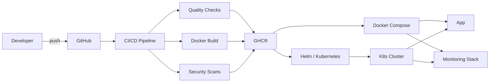

# DevOps & DevSecOps Documentation

This directory contains comprehensive documentation for the DevOps and DevSecOps infrastructure of **Consistium** — a habit tracking application. The documentation covers the full lifecycle from development to deployment, monitoring, and security.

---

## Documentation Index

| Document | Description |
|----------|-------------|
| [System Architecture](architecture.md) | High-level system design, component overview, and technology matrix |
| [CI/CD Pipeline](ci-cd-pipeline.md) | Automated build, test, and release pipeline with GitHub Actions |
| [DevSecOps Pipeline](devsecops-pipeline.md) | Security scanning, SAST, secret detection, and vulnerability management |
| [Docker & Container Setup](docker-setup.md) | Containerization strategy, Nginx configuration, and resource management |
| [Monitoring & Observability](monitoring.md) | Prometheus, Grafana, and Nginx metrics collection |
| [Kubernetes Deployment](kubernetes.md) | Helm chart, multi-environment configs, security hardening, and autoscaling |

---

## Quick Reference

| Component | Technology | Version |
|-----------|------------|---------|
| Containerization | Docker + nginx:alpine | latest |
| Orchestration | Docker Compose | v3 (implied) |
| Kubernetes | Helm Chart | v1.0.0 |
| CI/CD | GitHub Actions | v4 actions |
| Container Registry | GitHub Container Registry (GHCR) | - |
| SAST | GitHub CodeQL | v3 |
| Secret Scanning | TruffleHog | latest |
| Vulnerability Scanning | Aqua Trivy | latest |
| Monitoring | Prometheus | v2.51.0 |
| Dashboards | Grafana | v10.4.1 |
| Metrics Export | Nginx Prometheus Exporter | v1.1.0 |
| Linting | HTMLHint + Hadolint | latest |
| Versioning | Semantic Versioning (auto) | - |

---

## Infrastructure Overview

---

## Getting Started

- **Local Setup** — See [Docker & Container Setup](docker-setup.md) for instructions on building and running the application locally with Docker Compose.
- **Pipeline Overview** — See [CI/CD Pipeline](ci-cd-pipeline.md) to understand the automated build, test, and release workflow.
- **Kubernetes** — See [Kubernetes Deployment](kubernetes.md) for Helm chart usage, multi-environment deployment, and security hardening.
