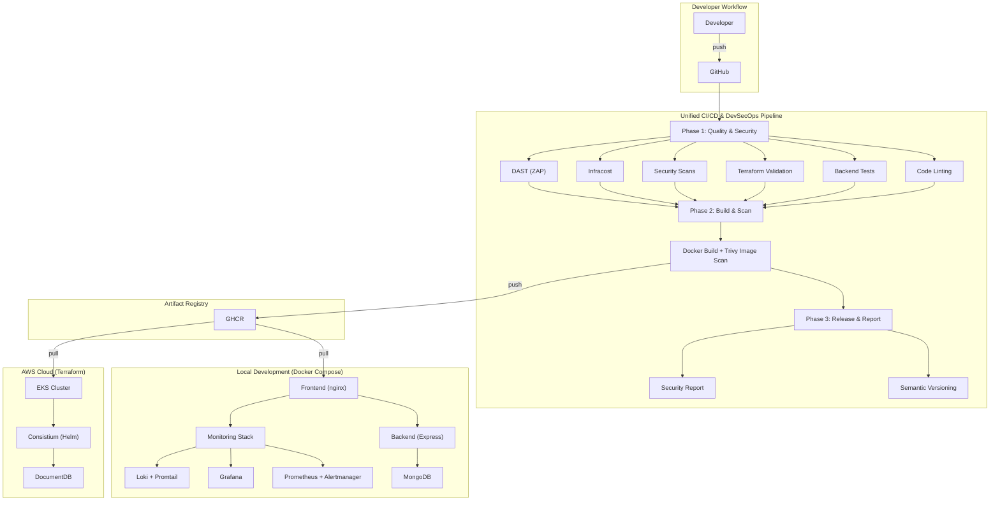

# DevOps & DevSecOps Documentation

This directory contains comprehensive documentation for the DevOps and DevSecOps infrastructure of **Consistium** — a full-stack habit tracking application. The documentation covers the full lifecycle from infrastructure provisioning and development through deployment, monitoring, and security.

---

## Documentation Index

| Document | Description |
|----------|-------------|
| [System Architecture](architecture.md) | High-level system design, component overview, and technology matrix |
| [Unified CI/CD & DevSecOps Pipeline](unified-pipeline.md) | Automated build, test, security scanning, and release pipeline with GitHub Actions |
| [Docker & Container Setup](docker-setup.md) | Containerization strategy, multi-stage builds, Docker Compose orchestration |
| [Monitoring & Observability](monitoring.md) | Prometheus, Grafana, Alertmanager, Loki, and backend metrics |
| [Kubernetes Deployment](kubernetes.md) | Helm chart, multi-environment configs, security hardening, and autoscaling |
| [Terraform Infrastructure as Code](terraform-iac.md) | AWS infrastructure provisioning — VPC, EKS, DocumentDB, remote state |

---

## Quick Reference

### Application Stack

| Component | Technology | Version |
|-----------|------------|---------|
| Frontend | HTML + CSS + JavaScript | — |
| Backend API | Node.js + Express | Node 20 / Express 4.19.2 |
| Database (Local) | MongoDB | 6 |
| Database (AWS) | Amazon DocumentDB | MongoDB-compatible |
| ODM | Mongoose | 8.3.4 |
| Authentication | JSON Web Tokens (jsonwebtoken) | 9.0.2 |
| Password Hashing | bcrypt | 5.1.1 |
| Testing | Jest + Supertest | Jest 30.4.2 / Supertest 7.2.2 |

### Containerization & Orchestration

| Component | Technology | Version |
|-----------|------------|---------|
| Frontend Container | nginx:1.27-alpine (multi-stage) | 1.27 |
| Backend Container | node:20-alpine (multi-stage) | 20 |
| Container Orchestration (Local) | Docker Compose | v2 |
| Kubernetes | Helm Chart | v1.0.0 |
| Container Registry | GitHub Container Registry (GHCR) | — |

### Infrastructure as Code

| Component | Technology | Version |
|-----------|------------|---------|
| IaC Framework | Terraform | >= 1.5.0, < 2.0.0 |
| Cloud Provider | AWS (ap-south-1) | — |
| Kubernetes Service | Amazon EKS | 1.30 |
| Managed Database | Amazon DocumentDB | — |
| Networking | AWS VPC + Subnets + NAT + IGW | — |
| State Backend | S3 + DynamoDB (locking) | — |
| Secret Encryption | AWS KMS | — |
| IAM | IRSA (pod-level IAM) | — |
| Terraform Linting | TFLint | v0.50.3 |
| Cost Estimation | Infracost | — |
| AWS Provider | hashicorp/aws | ~> 5.0 |
| Kubernetes Provider | hashicorp/kubernetes | ~> 2.30 |
| Helm Provider | hashicorp/helm | ~> 2.13 |

### CI/CD & Security

| Component | Technology | Version |
|-----------|------------|---------|
| CI/CD Platform | GitHub Actions | v4 actions |
| SAST | GitHub CodeQL | v3 |
| Secret Scanning | TruffleHog | latest |
| Vulnerability Scanning | Aqua Trivy | latest |
| DAST | OWASP ZAP | zaproxy/action-baseline@v0.14.0 |
| HTML Linting | HTMLHint | latest |
| Dockerfile Linting | Hadolint | v3.1.0 |
| Versioning | Semantic Versioning (auto) | — |
| FinOps | Infracost | v3 |

### Monitoring & Observability

| Component | Technology | Version |
|-----------|------------|---------|
| Metrics Collection | Prometheus | v2.51.0 |
| Alert Routing | Alertmanager | v0.27.0 |
| Dashboards | Grafana | 10.4.1 |
| Nginx Metrics Export | Nginx Prometheus Exporter | 1.1.0 |
| Backend Metrics | prom-client (Node.js) | 15.1.3 |
| Log Aggregation | Loki | 2.9.2 |
| Log Collection | Promtail | latest |

### Automation

| Component | Technology | Version |
|-----------|------------|---------|
| Configuration Management | Ansible | — |
| Email Notifications | Gmail SMTP (via Alertmanager + action-send-mail) | — |

---

## Infrastructure Overview

---

## Getting Started

- **Local Setup** — See [Docker & Container Setup](docker-setup.md) for instructions on building and running the full application stack (frontend + backend + database + monitoring) locally with Docker Compose.
- **Pipeline Overview** — See [Unified CI/CD & DevSecOps Pipeline](unified-pipeline.md) to understand the automated build, test, security scan, and release workflow.
- **Kubernetes** — See [Kubernetes Deployment](kubernetes.md) for Helm chart usage, multi-environment deployment, and security hardening.
- **Infrastructure** — See [Terraform Infrastructure as Code](terraform-iac.md) for AWS infrastructure provisioning with Terraform.
- **Monitoring** — See [Monitoring & Observability](monitoring.md) for Prometheus, Alertmanager, Grafana, and backend metrics setup.
