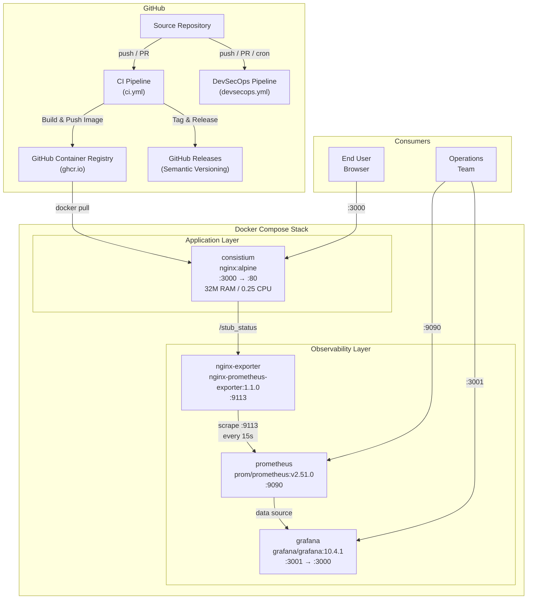
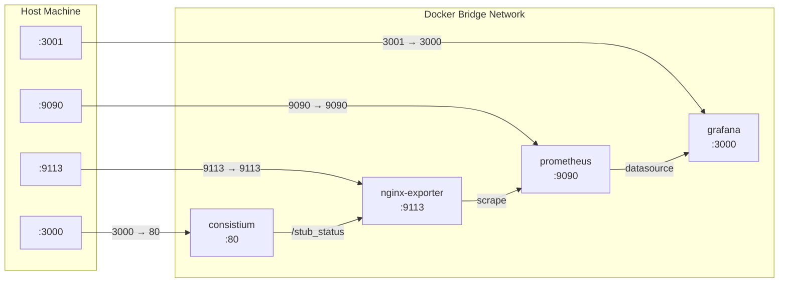

# System Architecture

Consistium is a lightweight, statically-served habit tracking application built with HTML, CSS, and JavaScript. The application is containerized using Docker and served through Nginx, with a full observability stack comprising Prometheus and Grafana. Two dedicated CI/CD pipelines — one for continuous integration and delivery, and one for DevSecOps — ensure code quality, automated releases, and security scanning across every change.

The following diagram illustrates the end-to-end system architecture, from source control through deployment and runtime monitoring.



---

## Application Layer

Consistium is a purely static front-end application — no server-side runtime, no database, and no API backend. The entire application consists of HTML, CSS, and JavaScript files served directly by Nginx.

### Static Asset Serving

The application source files are copied into the Nginx default document root (`/usr/share/nginx/html`) at image build time. Nginx serves these files with minimal overhead, making the container extremely lightweight and fast to start.

### Nginx Configuration

The `consistium` container runs the official `nginx:alpine` image, chosen for its minimal footprint (~5 MB base). Key configuration details include:

- **Port mapping**: Host port `3000` maps to container port `80`, keeping the host's standard HTTP port available for other services.
- **Healthcheck**: A built-in Docker healthcheck periodically verifies the container is responsive, enabling automatic restart on failure.
- **Stub Status**: The `/stub_status` endpoint is enabled to expose Nginx connection metrics for the observability layer.

---

## Containerization Layer

The project follows a minimal, security-conscious containerization strategy designed for predictable resource consumption and fast cold starts.

### Base Image Strategy

The `nginx:alpine` base image is selected for several reasons:

| Concern | Benefit |
|---|---|
| **Image size** | Alpine-based images are typically under 10 MB, reducing pull times and storage costs |
| **Attack surface** | Minimal package set reduces the number of potential CVEs |
| **Startup time** | Lightweight images start in under a second |
| **Compatibility** | Official Nginx images are well-maintained and widely tested |

### Resource Limits

The `consistium` container enforces strict resource constraints to prevent runaway resource consumption:

- **Memory limit**: `32M` — more than sufficient for serving static files, and prevents memory leaks from impacting the host.
- **CPU limit**: `0.25` — restricts the container to a quarter of a CPU core, ensuring fair scheduling alongside the observability stack.

### Docker Compose Orchestration

All four services are defined in a single `docker-compose.yml` file, enabling one-command deployment with `docker compose up`. Service dependencies and networking are managed declaratively, and all containers share a common Docker bridge network for inter-service communication.

---

## Observability Layer

The observability stack provides real-time insight into Nginx performance and connection metrics through a three-tier pipeline: **exporter → time-series database → visualization**.

### Metrics Collection Pipeline

```
consistium ──► nginx-exporter ──► prometheus ──► grafana
 /stub_status     :9113            :9090          :3001
```

1. **nginx-exporter** (`nginx/nginx-prometheus-exporter:1.1.0`): Connects to the Nginx `/stub_status` endpoint on the `consistium` container and translates the raw Nginx metrics into Prometheus-compatible format. Exposed on port `9113`.

2. **Prometheus** (`prom/prometheus:v2.51.0`): Scrapes the nginx-exporter target every **15 seconds**, storing time-series data for connection counts, request rates, and active/waiting connections. Accessible on port `9090` for direct PromQL queries.

3. **Grafana** (`grafana/grafana:10.4.1`): Provides pre-configured dashboards for visualizing Nginx metrics. Accessible on host port `3001` (mapped to container port `3000`). Ships with default credentials (`admin` / `admin`) for initial setup.

### Key Metrics Exposed

| Metric | Description |
|---|---|
| `nginx_connections_active` | Currently active client connections |
| `nginx_connections_accepted` | Total accepted connections |
| `nginx_connections_handled` | Total handled connections |
| `nginx_connections_reading` | Connections reading request headers |
| `nginx_connections_writing` | Connections writing responses |
| `nginx_connections_waiting` | Keep-alive connections waiting |
| `nginx_http_requests_total` | Total number of HTTP requests |

---

## CI/CD Layer

The project uses a GitHub Actions workflow (`ci.yml`) that automates quality checks, container image builds, and semantic releases on every push or pull request targeting the `main` or `master` branches.

### Pipeline Overview

| Job | Depends On | Purpose |
|---|---|---|
| **quality-checks** | — | Lints HTML with HTMLHint and validates the Dockerfile with Hadolint |
| **docker-build** | quality-checks | Builds a multi-platform image via Buildx, authenticates to GHCR, and pushes to `ghcr.io` |
| **build-artifact** | quality-checks | Packages the static HTML/CSS/JS files as downloadable GitHub Actions artifacts |
| **semantic-versioning** | docker-build, build-artifact | Automatically tags commits and creates GitHub Releases (runs only on `main`) |

> [!NOTE]
> For full pipeline configuration details, stage-by-stage breakdowns, and troubleshooting guidance, refer to the dedicated CI/CD documentation.

---

## Security Layer

A dedicated DevSecOps pipeline (`devsecops.yml`) runs automatically on every push and pull request to `main`/`master`, as well as on a **weekly cron schedule** (Sunday at midnight) to catch newly disclosed vulnerabilities.

### Scan Coverage

| Job | Tool | Scope |
|---|---|---|
| **secret-scan** | TruffleHog | Scans full Git history for leaked secrets, API keys, and credentials |
| **codeql-sast** | CodeQL (JavaScript) | Static Application Security Testing — identifies code-level vulnerabilities |
| **trivy-scan** | Trivy | Filesystem scan for dependency vulnerabilities + Docker image scan for OS-level CVEs |

> [!IMPORTANT]
> The weekly cron trigger ensures that even without code changes, the project is continuously evaluated against the latest vulnerability databases. For detailed security scan configurations and remediation workflows, refer to the dedicated DevSecOps documentation.

---

## Network Topology

The following diagram illustrates how external traffic reaches each service and how internal container-to-container communication flows over the Docker bridge network.



| Service | Host Port | Container Port | Protocol | Access |
|---|---|---|---|---|
| consistium | `3000` | `80` | HTTP | Public (end users) |
| nginx-exporter | `9113` | `9113` | HTTP | Internal / debug |
| prometheus | `9090` | `9090` | HTTP | Operations |
| grafana | `3001` | `3000` | HTTP | Operations |

---

## Technology Matrix

| Technology | Version | Category | Purpose |
|---|---|---|---|
| **Nginx** | Alpine (latest) | Web Server | Serves static HTML/CSS/JS application files |
| **Docker** | — | Containerization | Application packaging and isolation |
| **Docker Compose** | v2 | Orchestration | Multi-container service definition and management |
| **nginx-prometheus-exporter** | 1.1.0 | Observability | Translates Nginx stub_status into Prometheus metrics |
| **Prometheus** | 2.51.0 | Observability | Time-series metrics collection and storage |
| **Grafana** | 10.4.1 | Observability | Metrics visualization and dashboarding |
| **GitHub Actions** | — | CI/CD | Workflow automation for builds, tests, and releases |
| **Buildx** | — | CI/CD | Multi-platform Docker image builds |
| **GHCR** | — | CI/CD | Container image registry (GitHub Container Registry) |
| **HTMLHint** | Latest | Quality | HTML linting and validation |
| **Hadolint** | Latest | Quality | Dockerfile best-practice linting |
| **TruffleHog** | Latest | Security | Git history secret scanning |
| **CodeQL** | Latest | Security | Static Application Security Testing (JavaScript) |
| **Trivy** | Latest | Security | Filesystem and container image vulnerability scanning |
| **Semantic Versioning** | — | Release | Automated version tagging and GitHub Release creation |
