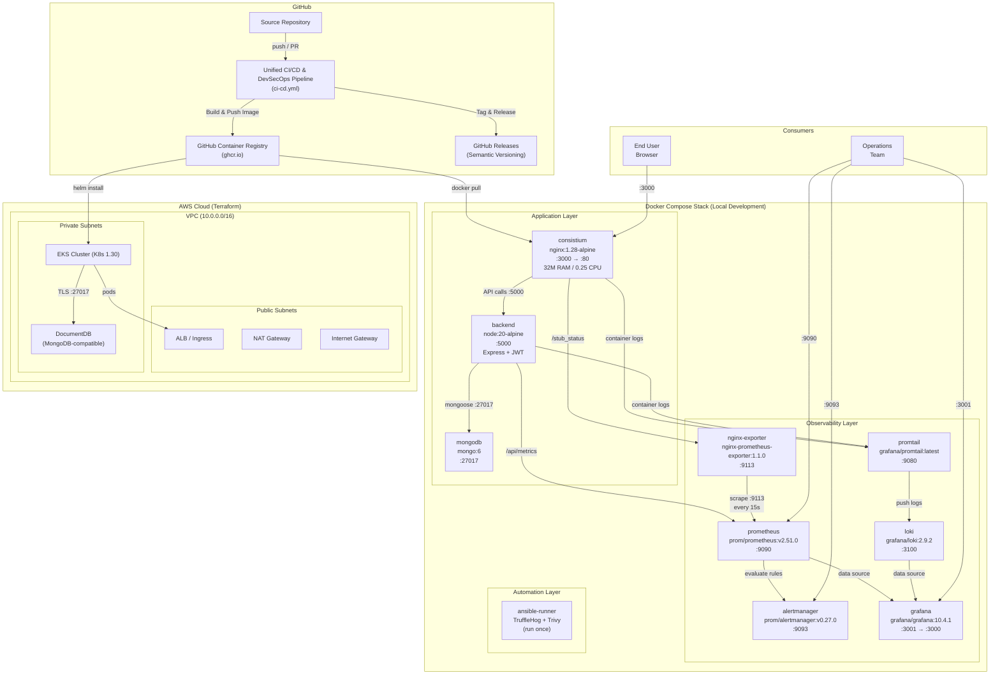
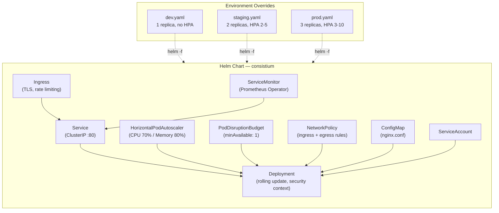
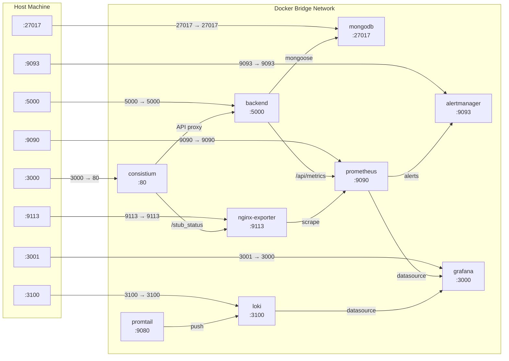

# System Architecture

Consistium is a full-stack habit tracking application comprising an **HTML/CSS/JavaScript frontend** served by Nginx, a **Node.js/Express backend API** with JWT authentication, and **MongoDB** for data persistence (Amazon DocumentDB in production). The application is containerized using Docker with multi-stage builds and orchestrated locally via Docker Compose or in production via a Helm chart on **Amazon EKS**. The entire AWS infrastructure — VPC, EKS cluster, and DocumentDB — is provisioned declaratively through **Terraform**. A comprehensive observability stack comprising Prometheus, Alertmanager, Grafana, Loki, and Promtail provides metrics, alerting, and log aggregation. A unified CI/CD pipeline automates quality checks, security scanning (SAST, DAST, SCA, secret scanning), container builds, FinOps cost estimation, and semantic releases.

The following diagram illustrates the end-to-end system architecture, from source control through deployment and runtime monitoring.



---

## Application Layer

Consistium is a full-stack web application with a frontend served by Nginx and a backend API powered by Node.js/Express.

### Frontend — Static Asset Serving

The frontend consists of HTML, CSS, and JavaScript files served directly by Nginx. The application source files are copied into the Nginx default document root (`/usr/share/nginx/html`) at image build time via a multi-stage Docker build. Nginx serves these files with minimal overhead, making the container extremely lightweight and fast to start.

### Backend — Express API

The backend is a **Node.js/Express** REST API that provides:

| Feature | Technology | Detail |
|---|---|---|
| **HTTP Framework** | Express 4.19.2 | RESTful API with CORS support |
| **Authentication** | jsonwebtoken 9.0.2 + bcrypt 5.1.1 | JWT-based auth with password hashing |
| **Database ODM** | Mongoose 8.3.4 | MongoDB object modeling |
| **Metrics** | prom-client 15.1.3 | Prometheus-compatible metrics at `/api/metrics` |
| **Health Check** | Built-in | `/api/health` endpoint for orchestrator probes |
| **Testing** | Jest 30.4.2 + Supertest 7.2.2 | Unit and integration tests |

#### API Routes

| Route Prefix | Purpose |
|---|---|
| `/api/auth` | User registration and login (JWT) |
| `/api/habits` | Habit CRUD operations |
| `/api/discipline-stats` | Discipline tracking and statistics |
| `/api/admin` | Administrative endpoints |
| `/api/health` | Health check for orchestrators |
| `/api/metrics` | Prometheus metrics (prom-client) |

### Database — MongoDB / DocumentDB

| Environment | Database | Details |
|---|---|---|
| **Local (Docker Compose)** | MongoDB 6 | Official `mongo:6` image, data persisted via Docker volume (`mongodb_data`) |
| **AWS (Production)** | Amazon DocumentDB | Managed, MongoDB-compatible, TLS-encrypted, multi-instance, automated backups |

### Nginx Configuration

The `consistium` container runs a pinned `nginx:1.28-alpine` image (not `latest`), chosen for its minimal footprint. Key configuration details include:

- **Port mapping**: Host port `3000` maps to container port `80`, keeping the host's standard HTTP port available for other services.
- **Healthcheck**: A built-in Docker healthcheck periodically verifies the container is responsive, enabling automatic restart on failure.
- **Stub Status**: The `/stub_status` endpoint is enabled to expose Nginx connection metrics for the observability layer.
- **Reverse Proxy**: API requests are proxied to the backend service.

---

## Containerization Layer

The project follows a security-conscious containerization strategy with **multi-stage builds** for both frontend and backend containers.

### Frontend Dockerfile — Multi-Stage Build

| Stage | Base Image | Purpose |
|---|---|---|
| **Stage 1: Validator** | `alpine:3.22` | Validates all required static assets exist and are non-empty before building the production image |
| **Stage 2: Production** | `nginx:1.28-alpine` | Production-grade Nginx with security hardening (non-root, OCI labels, minimal packages) |

#### Security Hardening

| Control | Implementation |
|---|---|
| Non-root execution | `USER 101` (nginx user) |
| Package reduction | Removes unnecessary packages (curl) |
| OCI Labels | Standard image metadata for registries and scanners |
| Health check | Built-in `wget` health check |
| Asset validation | Stage 1 catches missing files at build time, not runtime |

### Backend Dockerfile — Multi-Stage Build

| Stage | Base Image | Purpose |
|---|---|---|
| **Stage 1: Builder** | `node:20-alpine` | Installs production dependencies only (`npm ci --omit=dev`) |
| **Stage 2: Production** | `node:20-alpine` | Minimal production image with dumb-init for proper PID 1 signal handling |

#### Security Hardening

| Control | Implementation |
|---|---|
| Non-root execution | `USER node` (UID 1000) |
| Signal handling | `dumb-init` as PID 1 for graceful shutdown |
| Production-only deps | `--omit=dev` excludes devDependencies |
| OCI Labels | Standard image metadata |
| Health check | Built-in `wget` to `/api/health` |

### Resource Limits

The `consistium` frontend container enforces strict resource constraints:

- **Memory limit**: `32M` — sufficient for serving static files; prevents memory leaks.
- **CPU limit**: `0.25` — restricts the container to a quarter of a CPU core.

### Docker Compose Orchestration

All **nine services** are defined in a single `docker-compose.yml` file, enabling one-command deployment with `docker compose up`. Services include the application layer (frontend, backend, database), the observability layer (nginx-exporter, prometheus, alertmanager, grafana, loki, promtail), and the automation layer (ansible-runner).

---

## Infrastructure as Code Layer

Production infrastructure is provisioned declaratively using **Terraform** with a modular architecture targeting **AWS**.

### Architecture

```
VPC (10.0.0.0/16)
├── Public Subnets (ALB, NAT Gateway, Internet Gateway)
└── Private Subnets (EKS Cluster, DocumentDB)
```

### Terraform Modules

| Module | Purpose | Key Resources |
|---|---|---|
| **VPC** | Networking | VPC, public/private subnets, NAT Gateway, Internet Gateway, VPC Flow Logs |
| **EKS** | Kubernetes | EKS cluster (v1.30), managed node groups (t3.medium), IRSA (OIDC), KMS encryption |
| **DocumentDB** | Database | DocumentDB cluster, instances, security groups, CloudWatch alarms, automated backups |

### Provider Stack

| Provider | Version | Purpose |
|---|---|---|
| `hashicorp/aws` | ~> 5.0 | AWS resource provisioning |
| `hashicorp/kubernetes` | ~> 2.30 | Kubernetes resource management |
| `hashicorp/helm` | ~> 2.13 | Helm chart deployment |
| `hashicorp/tls` | ~> 4.0 | TLS certificate management |

### State Management

| Component | Technology | Purpose |
|---|---|---|
| State Storage | AWS S3 | Encrypted remote state file |
| State Locking | AWS DynamoDB | Prevents concurrent modifications |

### Multi-Environment Strategy

| Feature | Dev | Staging | Production |
|---|---|---|---|
| Node Instance | t3.small × 1 | t3.medium × 2 | t3.large × 3 |
| DocumentDB | db.t3.medium × 1 | db.t3.medium × 2 | db.r6g.large × 3 |
| Monthly Cost | ~$90 | ~$180 | ~$500 |

> [!NOTE]
> For full Terraform documentation including usage commands, security highlights, and module details, see the dedicated [Terraform Infrastructure as Code](terraform-iac.md) document.

---

## Observability Layer

The observability stack provides real-time insight into application performance through a **metrics pipeline**, an **alerting pipeline**, and a **logs pipeline**.

### Metrics Collection Pipeline

```
Frontend (nginx) ──► nginx-exporter ──► Prometheus ──► Grafana
 /stub_status          :9113              :9090          :3001

Backend (Express) ──► Prometheus ──► Grafana
 /api/metrics           :9090        :3001

Prometheus ──► Alertmanager ──► Email Notifications
  rules         :9093           (Gmail SMTP)

All containers ──► Promtail ──► Loki ──► Grafana
 docker logs        :9080       :3100     :3001
```

### Components

1. **nginx-exporter** (`nginx/nginx-prometheus-exporter:1.1.0`): Translates Nginx `/stub_status` into Prometheus-compatible metrics. Port `9113`.

2. **Prometheus** (`prom/prometheus:v2.51.0`): Scrapes 4 targets (nginx-exporter, prometheus self, alertmanager, backend) every 15 seconds. Evaluates alert rules and recording rules. Port `9090`.

3. **Alertmanager** (`prom/alertmanager:v0.27.0`): Routes alerts by severity (critical, warning, security) to email receivers. Supports inhibition rules to prevent alert storms. Port `9093`.

4. **Grafana** (`grafana/grafana:10.4.1`): Pre-configured dashboards with auto-provisioned data sources (Prometheus, Loki). Port `3001`.

5. **Loki** (`grafana/loki:2.9.2`): Log aggregation with label-based indexing. Port `3100`.

6. **Promtail** (`grafana/promtail:latest`): Docker service discovery, ships container logs to Loki. Port `9080`.

7. **prom-client** (Node.js, `15.1.3`): In-app Prometheus instrumentation in the Express backend, exposing custom metrics at `/api/metrics`.

### Key Metrics

| Source | Metric | Description |
|---|---|---|
| Nginx | `nginx_connections_active` | Currently active client connections |
| Nginx | `nginx_http_requests_total` | Total number of HTTP requests |
| Nginx | `nginx_connections_reading/writing/waiting` | Connection state breakdown |
| Backend | Custom Express metrics | Request duration, status codes, active connections |
| Prometheus | `prometheus_*` | Self-monitoring metrics |
| Alertmanager | `alertmanager_*` | Alert pipeline health |

---

## Kubernetes Orchestration Layer

For production deployments, Consistium includes a Helm chart that packages the application as a set of Kubernetes resources with enterprise-grade features.

### Helm Chart Architecture



### Kubernetes Resources

| Resource | Purpose |
|---|---|
| **Deployment** | Rolling updates, security context (non-root, read-only FS, drop all capabilities), liveness/readiness/startup probes, pod anti-affinity |
| **Service** | ClusterIP service exposing port 80 with named ports |
| **Ingress** | TLS termination via cert-manager, rate limiting (50 rps), SSL redirect, HSTS in production |
| **HPA** | Autoscaling 2→10 pods on CPU (70%) and memory (80%) with stabilization policies |
| **PDB** | Guarantees minimum availability during node drains and cluster upgrades |
| **NetworkPolicy** | Zero-trust: ingress only from ingress-nginx and monitoring namespaces, egress DNS-only |
| **ConfigMap** | Nginx configuration with security headers (CSP, X-Frame-Options), structured logging |
| **ServiceAccount** | Dedicated non-default service account for RBAC |
| **ServiceMonitor** | Prometheus Operator CRD for automatic scrape target discovery |

### Multi-Environment Strategy

| Feature | Dev | Staging | Production |
|---|---|---|---|
| Replicas | 1 | 2 | 3 |
| HPA Range | Disabled | 2–5 | 3–10 |
| PDB | Disabled | minAvailable: 1 | minAvailable: 2 |
| Network Policy | Disabled | Enabled | Enabled |
| TLS | Disabled | Enabled | Enabled + HSTS |
| Pod Anti-Affinity | None | Preferred | **Required** |

---

## CI/CD Layer

The project uses a **unified** GitHub Actions workflow ([`ci-cd.yml`](file:///f:/habit-tracker/.github/workflows/ci-cd.yml)) that combines CI/CD and DevSecOps into a single pipeline with 3 phases and 10 jobs.

### Pipeline Overview

| Phase | Jobs | Purpose |
|---|---|---|
| **Phase 1: Source Checks** (Parallel) | `quality-checks`, `backend-tests`, `terraform-checks`, `infracost-estimation`, `secret-scan`, `codeql-sast`, `trivy-fs-scan`, `dast-scan` | Lint, test, scan, and validate |
| **Phase 2: Build & Scan** | `docker-build-scan-push` | Build Docker image, Trivy image scan, push to GHCR |
| **Phase 3: Release & Report** | `semantic-versioning`, `security-report` | Version tagging, GitHub Release, branded security + FinOps report |

### Concurrency Control

The pipeline uses `cancel-in-progress: true` to automatically cancel redundant runs when new commits are pushed to the same branch.

> [!NOTE]
> For full pipeline configuration details, stage-by-stage breakdowns, and troubleshooting guidance, refer to the dedicated [Unified CI/CD & DevSecOps Pipeline](unified-pipeline.md) documentation.

---

## Security Layer

Security is integrated across every layer of the stack using a **shift-left** philosophy.

### Scan Coverage

| Job | Tool | Scope |
|---|---|---|
| **secret-scan** | TruffleHog | Scans full Git history for leaked secrets, API keys, and credentials |
| **codeql-sast** | CodeQL (JavaScript) | Static Application Security Testing — identifies code-level vulnerabilities |
| **trivy-fs-scan** | Trivy (filesystem) | Dependency vulnerabilities in `package.json` / `package-lock.json` |
| **docker-build-scan-push** | Trivy (image) | OS-level CVEs in the built Docker image |
| **dast-scan** | OWASP ZAP | Dynamic Application Security Testing — tests the running application |
| **security-report** | Custom Generator + Gmail SMTP | Aggregates all scan + FinOps results into a branded HTML report |

> [!IMPORTANT]
> The pipeline runs on every push and PR to `main`/`master`. After each run, a branded security and FinOps report is automatically generated and emailed to the project maintainer.

---

## Network Topology

The following diagram illustrates how external traffic reaches each service and how internal container-to-container communication flows over the Docker bridge network.



| Service | Host Port | Container Port | Protocol | Access |
|---|---|---|---|---|
| consistium | `3000` | `80` | HTTP | Public (end users) |
| backend | `5000` | `5000` | HTTP | Internal / API |
| mongodb | `27017` | `27017` | TCP | Internal / debug |
| nginx-exporter | `9113` | `9113` | HTTP | Internal / debug |
| prometheus | `9090` | `9090` | HTTP | Operations |
| alertmanager | `9093` | `9093` | HTTP | Operations |
| grafana | `3001` | `3000` | HTTP | Operations |
| loki | `3100` | `3100` | HTTP | Operations |
| promtail | — | `9080` | HTTP | Internal only |
| ansible-runner | — | — | — | One-shot task |

---

## Technology Matrix

| Technology | Version | Category | Purpose |
|---|---|---|---|
| **Nginx** | 1.28-alpine | Web Server | Serves static HTML/CSS/JS and proxies API requests |
| **Node.js** | 20-alpine | Runtime | Backend API server |
| **Express** | 4.19.2 | Framework | RESTful API framework |
| **MongoDB** | 6 | Database | Document database (local development) |
| **Mongoose** | 8.3.4 | ODM | MongoDB object data modeling |
| **jsonwebtoken** | 9.0.2 | Authentication | JWT token generation and verification |
| **bcrypt** | 5.1.1 | Security | Password hashing |
| **prom-client** | 15.1.3 | Observability | Prometheus client library for Node.js |
| **Docker** | — | Containerization | Application packaging with multi-stage builds |
| **Docker Compose** | v2 | Orchestration | Multi-container service definition (9 services) |
| **nginx-prometheus-exporter** | 1.1.0 | Observability | Translates Nginx stub_status into Prometheus metrics |
| **Prometheus** | 2.51.0 | Observability | Time-series metrics collection, alert rule evaluation |
| **Alertmanager** | 0.27.0 | Observability | Alert routing, grouping, inhibition, email notification |
| **Grafana** | 10.4.1 | Observability | Metrics visualization, dashboarding, auto-provisioned |
| **Loki** | 2.9.2 | Observability | Log aggregation, storage, and querying via LogQL |
| **Promtail** | latest | Observability | Log collection and shipping via Docker service discovery |
| **Terraform** | >= 1.5.0 | IaC | AWS infrastructure provisioning |
| **AWS EKS** | K8s 1.30 | Orchestration | Managed Kubernetes cluster |
| **AWS DocumentDB** | — | Database | Managed MongoDB-compatible database (production) |
| **AWS VPC** | — | Networking | Virtual Private Cloud with public/private subnets |
| **AWS S3** | — | State | Terraform remote state storage |
| **AWS DynamoDB** | — | State | Terraform state locking |
| **AWS KMS** | — | Security | EKS secret encryption at rest |
| **GitHub Actions** | — | CI/CD | Unified pipeline automation (10 jobs, 3 phases) |
| **Buildx** | — | CI/CD | Multi-platform Docker image builds with BuildKit |
| **GHCR** | — | CI/CD | Container image registry (GitHub Container Registry) |
| **HTMLHint** | latest | Quality | HTML linting and validation |
| **Hadolint** | latest | Quality | Dockerfile best-practice linting |
| **TFLint** | 0.50.3 | Quality | Terraform linting with AWS ruleset |
| **TruffleHog** | latest | Security | Git history secret scanning |
| **CodeQL** | latest | Security | Static Application Security Testing (JavaScript) |
| **Trivy** | latest | Security | Filesystem and container image vulnerability scanning |
| **OWASP ZAP** | latest | Security | Dynamic Application Security Testing |
| **Infracost** | latest | FinOps | Infrastructure cost estimation |
| **Ansible** | — | Automation | Local security report generation playbook |
| **Jest** | 30.4.2 | Testing | JavaScript unit testing framework |
| **Supertest** | 7.2.2 | Testing | HTTP assertion library for API testing |
| **dumb-init** | latest | Container | PID 1 signal forwarding for graceful shutdown |
| **Helm** | v3.12+ | Orchestration | Kubernetes package management with templated manifests |
| **Kubernetes** | v1.28+ | Orchestration | Container orchestration with Deployment, HPA, PDB, NetworkPolicy |
| **Security Report Generator** | Custom | Security | Aggregates scan + FinOps results into branded HTML report |
| **action-send-mail** | v3 | Notification | Delivers security reports and release documents via Gmail SMTP |
| **Semantic Versioning** | — | Release | Automated version tagging and GitHub Release creation |
