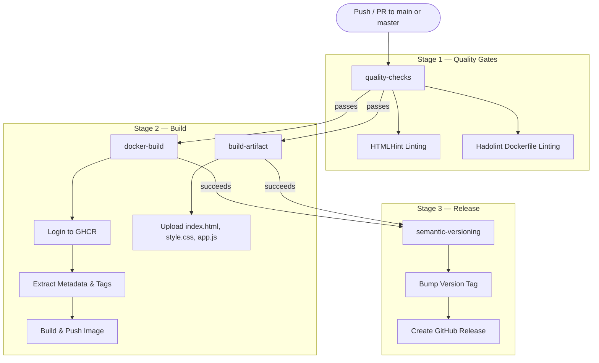
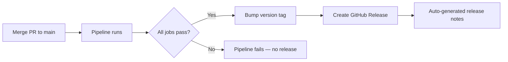

# CI/CD Pipeline

Consistium's CI/CD pipeline enforces a disciplined path from code change to production-ready release. Every commit flows through a series of **automated quality gates**, followed by **parallel build stages**, and finally a **semantic release** — ensuring that only validated, versioned artifacts ever reach end users.

The pipeline is defined in [`.github/workflows/ci.yml`](file:///f:/habit-tracker/.github/workflows/ci.yml) and orchestrated entirely by GitHub Actions.

---

## Pipeline Architecture

The pipeline is composed of four jobs arranged in a diamond-shaped dependency graph. Quality checks must pass before any build work begins, and both build jobs must succeed before a release is cut.



---

## Pipeline Triggers

The pipeline activates on two event types:

| Event | Branches | Purpose |
|---|---|---|
| `push` | `main`, `master` | Validate merged code and cut a release |
| `pull_request` | `main`, `master` | Gate incoming changes before merge |

This dual-trigger strategy ensures that:

- **Pull requests** receive full quality and build validation _before_ a maintainer approves the merge, catching issues early.
- **Pushes to the default branch** re-run the full pipeline and, upon success, trigger the semantic versioning and release job — guaranteeing that every merge results in a versioned, tagged release.

---

## Job 1 — `quality-checks`

**Purpose:** Act as the first line of defense by statically analyzing source code and infrastructure definitions before any compute-intensive build work begins.

**Runs on:** `ubuntu-latest`

### Steps

| # | Step | Tool / Action | Details |
|---|---|---|---|
| 1 | Checkout repository | `actions/checkout@v4` | Fetches the full working tree for analysis |
| 2 | Setup Node.js | `actions/setup-node@v4` | Installs Node.js 20.x for npx-based tooling |
| 3 | HTMLHint linting | `npx htmlhint "**/*.html" \|\| true` | Lints all HTML files against best-practice rules |
| 4 | Hadolint Dockerfile linting | `hadolint/hadolint-action@v3.1.0` | Validates Dockerfile instructions against best practices |

### Design Rationale

- **HTMLHint** is run via `npx` to avoid committing a global dependency. The `|| true` suffix makes the step non-blocking — lint warnings are surfaced in the log but do not fail the pipeline, allowing teams to adopt linting incrementally.
- **Hadolint** is the industry-standard Dockerfile linter, backed by ShellCheck for `RUN` instruction analysis. Running it as a dedicated GitHub Action ensures it uses the latest rule set and integrates cleanly with PR annotations.
- By isolating quality checks in their own job, build resources are never consumed for code that fails basic validation.

---

## Job 2 — `docker-build`

**Purpose:** Build the application's Docker image and publish it to the GitHub Container Registry (GHCR).

**Depends on:** `quality-checks`

**Permissions:** `contents: read`, `packages: write`

### Steps

| # | Step | Tool / Action | Details |
|---|---|---|---|
| 1 | Checkout repository | `actions/checkout@v4` | Fetches source and Dockerfile |
| 2 | Setup Docker Buildx | `docker/setup-buildx-action@v3` | Enables BuildKit features (layer caching, multi-platform builds) |
| 3 | Login to GHCR | `docker/login-action@v3` | Authenticates to `ghcr.io` using the built-in `GITHUB_TOKEN` |
| 4 | Extract lowercase repo name | Shell step | Normalises the repository name to lowercase for OCI compliance |
| 5 | Extract Docker metadata | `docker/metadata-action@v5` | Generates image tags: `latest` (default branch only) + short SHA |
| 6 | Build and push | `docker/build-push-action@v5` | Builds the image with GitHub Actions cache and pushes to GHCR |

### Design Rationale

- **Docker Buildx** replaces the legacy builder and unlocks BuildKit's advanced layer caching, which dramatically reduces rebuild times.
- **`docker/metadata-action`** centralises tagging logic — no hand-rolled shell scripts to maintain. It automatically derives the correct tags from the Git context.
- The lowercase extraction step is necessary because Docker image names are case-sensitive and must be lowercase, while GitHub repository names may contain uppercase characters.

---

## Job 3 — `build-artifact`

**Purpose:** Package the application's static assets as a downloadable GitHub Actions artifact for non-containerised deployment or manual inspection.

**Depends on:** `quality-checks`

### Artifact Contents

| File | Role |
|---|---|
| `index.html` | Application entry point |
| `style.css` | Stylesheet |
| `app.js` | Client-side application logic |

### Configuration

- **Retention period:** 7 days — long enough for debugging and downstream consumption, short enough to avoid storage bloat.
- This job runs in parallel with `docker-build`, maximising pipeline throughput by using the diamond dependency pattern.

### Design Rationale

Providing a standalone artifact alongside the Docker image serves two purposes:

1. **Deployment flexibility** — teams that deploy to static hosting (e.g., GitHub Pages, Netlify, S3) can consume the artifact directly without Docker.
2. **Auditability** — reviewers can download and inspect the exact files that were built from a given commit.

---

## Job 4 — `semantic-versioning`

**Purpose:** Automatically tag the repository with a semantic version and create a GitHub Release with auto-generated release notes.

**Depends on:** `docker-build` + `build-artifact`

**Condition:** Runs only on pushes to `main` or `master` (not on pull requests).

**Permissions:** `contents: write`

### Steps

| # | Step | Tool / Action | Details |
|---|---|---|---|
| 1 | Checkout repository | `actions/checkout@v4` | Fetches Git history for tag analysis |
| 2 | Bump version | `mathieudutour/github-tag-action@v6.2` | Calculates the next version and creates a Git tag (default: patch bump) |
| 3 | Create GitHub Release | `softprops/action-gh-release@v2` | Publishes a release with auto-generated notes from merged PRs and commits |

### Design Rationale

- **Automatic patch bumping** means every successful merge to the default branch produces a new version (`v1.0.0` → `v1.0.1`) with zero manual effort.
- The `github-tag-action` supports [Conventional Commits](https://www.conventionalcommits.org/) — if a commit message contains `feat:`, it bumps the minor version; `BREAKING CHANGE:` bumps the major version.
- By gating the release on _both_ build jobs, we guarantee that the version tag corresponds to a commit where the Docker image was successfully published _and_ the static artifact was successfully built.

---

## Container Registry Strategy

Consistium images are published to the **GitHub Container Registry (GHCR)** at `ghcr.io`.

### Why GHCR?

| Consideration | GHCR Advantage |
|---|---|
| **Authentication** | Uses the built-in `GITHUB_TOKEN` — no external secrets to manage |
| **Proximity** | Co-located with the source repository for minimal latency |
| **Visibility** | Images are linked to the repository and visible in the Packages tab |
| **Cost** | Free for public repositories; generous allowance for private ones |
| **OCI Compliance** | Fully OCI-compliant registry, compatible with any container runtime |

### Tagging Strategy

Every image push produces **two tags**:

| Tag | Example | Purpose |
|---|---|---|
| `latest` | `ghcr.io/owner/repo:latest` | Always points to the most recent default-branch build. Useful for development and `docker-compose` workflows. |
| Short SHA | `ghcr.io/owner/repo:a1b2c3d` | Immutable, commit-pinned tag. Used for production deployments and rollback scenarios. |

This dual-tag approach balances convenience (`latest` for local development) with reproducibility (SHA tags for production).

---

## Caching Strategy

Docker layer caching is implemented using the **GitHub Actions cache backend** (`type=gha`), configured in the `docker/build-push-action` step.

```yaml
cache-from: type=gha
cache-to: type=gha,mode=max
```

### How It Works

1. After each build, all Docker layers are exported to the GitHub Actions cache.
2. On subsequent builds, BuildKit pulls cached layers and only rebuilds layers whose inputs have changed.
3. The `mode=max` setting caches _all_ layers — including intermediate layers — not just the final image layers. This maximises cache hit rates for multi-stage builds.

### Benefits

| Metric | Without Cache | With GHA Cache |
|---|---|---|
| Typical build time | 60–120s | 10–30s |
| Network transfer | Full base image pull | Cached layers only |
| Storage | N/A | Managed by GitHub (10 GB limit) |

The GHA cache backend was chosen over registry-based caching (`type=registry`) because it avoids polluting the container registry with cache manifests and requires no additional authentication configuration.

---

## Release Strategy

Consistium follows an **automated semantic versioning** strategy powered by Git tags and GitHub Releases.

### Version Lifecycle



### Versioning Rules

| Commit Pattern | Version Bump | Example |
|---|---|---|
| Default (any commit) | **Patch** | `v1.2.3` → `v1.2.4` |
| `feat:` prefix | **Minor** | `v1.2.3` → `v1.3.0` |
| `BREAKING CHANGE:` in body | **Major** | `v1.2.3` → `v2.0.0` |

### Release Notes

GitHub Releases are created with **auto-generated release notes**, which aggregate:

- PR titles merged since the last release
- Commit messages for direct pushes
- Contributor acknowledgements

This removes the burden of manually writing changelogs while keeping stakeholders informed of what shipped in each version.

---

## Pipeline Configuration Reference

A consolidated reference of all GitHub Actions used in the pipeline:

| Action | Version | Job | Purpose |
|---|---|---|---|
| `actions/checkout` | `v4` | All jobs | Clone the repository |
| `actions/setup-node` | `v4` | `quality-checks` | Install Node.js 20.x for linting tools |
| `hadolint/hadolint-action` | `v3.1.0` | `quality-checks` | Lint Dockerfiles against best practices |
| `docker/setup-buildx-action` | `v3` | `docker-build` | Enable Docker BuildKit builder |
| `docker/login-action` | `v3` | `docker-build` | Authenticate to GHCR |
| `docker/metadata-action` | `v5` | `docker-build` | Generate image tags and labels |
| `docker/build-push-action` | `v5` | `docker-build` | Build and push Docker images |
| `actions/upload-artifact` | _(built-in)_ | `build-artifact` | Upload static files as pipeline artifact |
| `mathieudutour/github-tag-action` | `v6.2` | `semantic-versioning` | Calculate and apply semantic version tags |
| `softprops/action-gh-release` | `v2` | `semantic-versioning` | Create GitHub Releases with release notes |

> [!TIP]
> Pin actions to full SHA hashes in production pipelines (e.g., `actions/checkout@b4ffde6...`) to protect against supply-chain attacks via tag mutation. Version tags are shown here for readability.
