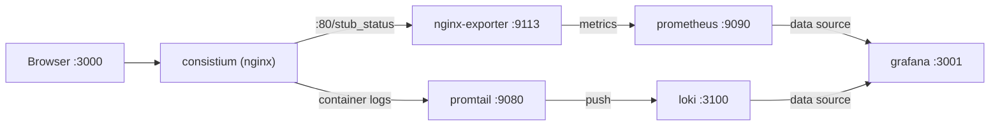
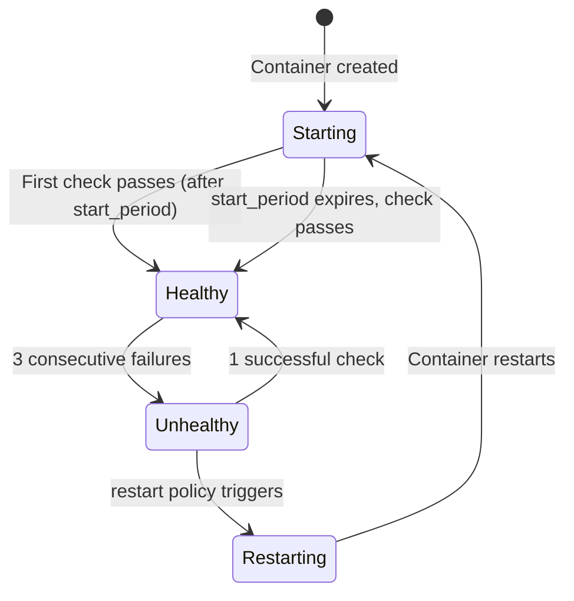
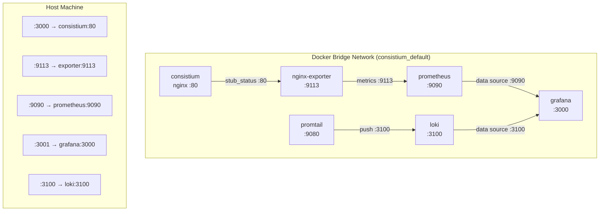

# Docker & Container Setup

Consistium is a lightweight, static front-end habit tracker application. Its containerization strategy reflects this simplicity: a single **nginx:alpine** image serves the static assets (HTML, CSS, JavaScript) with production-grade defaults — gzip compression, long-lived cache headers, and a minimal resource footprint. An accompanying **Docker Compose** stack layers on observability through Prometheus metrics export and Grafana dashboards, and log aggregation through Loki and Promtail, giving full production visibility without bloating the core application image.

The entire stack — app, metrics exporter, time-series database, and dashboard — runs comfortably on a single machine with under **256 MB of total RAM**, making it ideal for personal servers, Raspberry Pi deployments, and CI/CD preview environments.

---

## Dockerfile Breakdown

```dockerfile
FROM nginx:alpine
RUN rm -rf /usr/share/nginx/html/*
COPY index.html /usr/share/nginx/html/
COPY style.css /usr/share/nginx/html/
COPY app.js /usr/share/nginx/html/
COPY nginx.conf /etc/nginx/nginx.conf
EXPOSE 80
CMD ["nginx", "-g", "daemon off;"]
```

### Line-by-Line Explanation

| Line | Directive | Purpose |
|------|-----------|---------|
| 1 | `FROM nginx:alpine` | Uses the official Nginx image built on Alpine Linux — a security-focused, minimal distribution. Alpine produces images that are roughly **~40 MB** compared to **~140 MB** for Debian-based Nginx images. |
| 2 | `RUN rm -rf /usr/share/nginx/html/*` | Removes the default Nginx welcome page and placeholder files. This ensures only Consistium's assets are served, eliminating information leakage from default content. |
| 3–5 | `COPY index.html ...` | Copies the three static application files into Nginx's document root. Each file is copied individually rather than using a wildcard (`COPY . ...`) to avoid accidentally bundling development files (e.g., `node_modules`, `.git`, `docker-compose.yml`) into the image. |
| 6 | `COPY nginx.conf ...` | Replaces the default Nginx configuration with a custom one optimized for static-site serving, compression, caching, and metrics exposure. |
| 7 | `EXPOSE 80` | Documents that the container listens on port 80. This is metadata for orchestrators and developers — it does not actually publish the port. |
| 8 | `CMD ["nginx", "-g", "daemon off;"]` | Starts Nginx in the **foreground**. By default Nginx daemonizes itself, which would cause the container to exit immediately. The `daemon off` directive keeps the master process in the foreground so Docker can track its lifecycle and forward signals correctly. |

### Why Alpine?

- **Minimal attack surface**: Alpine ships with musl libc and BusyBox instead of glibc and GNU coreutils, resulting in far fewer installed packages and a smaller CVE footprint.
- **Fast pulls and deploys**: A ~40 MB image transfers quickly over the network, reducing CI/CD pipeline times and cold-start latency in orchestrators like Kubernetes.
- **Sufficient for static serving**: Consistium has no server-side runtime dependencies (no Node.js, no Python). Nginx on Alpine is a purpose-built fit.

### Why Nginx?

- **Battle-tested performance**: Nginx's event-driven architecture handles thousands of concurrent connections with minimal memory overhead — far more efficient than a Node.js static server for pure file serving.
- **Built-in compression and caching**: Native `gzip` and `expires` directives eliminate the need for external middleware.
- **Prometheus integration**: The `stub_status` module provides connection metrics out of the box, enabling observability without application-level instrumentation.

---

## Nginx Configuration

The custom `nginx.conf` is tuned for a low-traffic, single-instance static site with observability hooks.

### Worker Processes and Connections

```nginx
worker_processes 1;

events {
    worker_connections 128;
}
```

| Directive | Value | Rationale |
|-----------|-------|-----------|
| `worker_processes` | `1` | A single worker is sufficient for a personal habit tracker. Each worker consumes memory, and one process can handle the expected concurrency. For higher traffic, set this to `auto` to match available CPU cores. |
| `worker_connections` | `128` | The maximum number of simultaneous connections per worker. For a static site with a single user (or a small team), 128 is generous. The default of 1024 would waste kernel memory on unused connection slots. |

### Gzip Compression

```nginx
gzip on;
gzip_types text/css application/javascript text/html;
gzip_min_length 256;
```

| Directive | Value | Rationale |
|-----------|-------|-----------|
| `gzip on` | — | Enables on-the-fly gzip compression for responses. This reduces transfer sizes by **60–80%** for text-based assets. |
| `gzip_types` | `text/css application/javascript text/html` | Compresses CSS, JavaScript, and HTML files. Binary formats (images, fonts) are excluded because they are already compressed and gzipping them wastes CPU cycles. |
| `gzip_min_length` | `256` | Responses smaller than 256 bytes are not compressed. Tiny responses see negligible size reduction but still incur CPU overhead and gzip framing bytes, sometimes making the output *larger* than the original. |

### Static Asset Caching

```nginx
location ~* \.(css|js|html)$ {
    expires 7d;
    add_header Cache-Control "public, immutable";
}
```

| Directive | Value | Rationale |
|-----------|-------|-----------|
| `expires` | `7d` | Sets the `Expires` header to 7 days in the future. Browsers will serve these files from their local cache without contacting the server for a full week, reducing bandwidth and improving perceived load times. |
| `Cache-Control` | `public, immutable` | `public` allows CDNs and shared caches to store the response. `immutable` tells the browser that the resource will **never change** during its freshness lifetime, preventing conditional revalidation requests (e.g., `If-Modified-Since` checks). This is safe because a new deployment rebuilds the Docker image with updated files. |

### Stub Status Endpoint

```nginx
location /stub_status {
    stub_status;
}
```

The `stub_status` module exposes a plain-text page with real-time Nginx connection metrics:

```
Active connections: 2
server accepts handled requests
 15 15 45
Reading: 0 Writing: 1 Waiting: 1
```

This endpoint is scraped by the **nginx-prometheus-exporter** sidecar service every few seconds and converted into Prometheus-compatible metrics (e.g., `nginx_connections_active`, `nginx_http_requests_total`). It is lightweight — no logs, no JSON parsing — and adds negligible overhead.

### SPA-Style Routing

```nginx
location / {
    try_files $uri $uri/ /index.html;
}
```

The `try_files` directive attempts to serve the requested URI as a file, then as a directory, and finally falls back to `index.html`. This enables client-side routing: if a user navigates directly to `/settings` or `/dashboard`, Nginx serves `index.html` instead of returning a 404, allowing the JavaScript application to handle the route.

---

## Docker Compose Services

The `docker-compose.yml` defines six services that form a complete application-plus-observability stack:



### 1. `consistium` — Application Server

```yaml
consistium:
  build: .
  ports:
    - "3000:80"
  restart: unless-stopped
  deploy:
    resources:
      limits:
        cpus: "0.25"
        memory: 32M
      reservations:
        cpus: "0.05"
        memory: 8M
  healthcheck:
    test: ["CMD", "wget", "--spider", "-q", "http://localhost:80/"]
    interval: 30s
    timeout: 5s
    retries: 3
    start_period: 10s
```

| Field | Value | Purpose |
|-------|-------|---------|
| `build: .` | Builds from the Dockerfile in the project root. |
| `ports: "3000:80"` | Maps host port **3000** to container port **80**. Users access the app at `http://localhost:3000`. |
| `restart: unless-stopped` | Automatically restarts the container on crash or host reboot, but not if the user explicitly stops it with `docker compose stop`. |
| `deploy.resources` | See [Resource Management](#resource-management) below. |
| `healthcheck` | See [Health Checks](#health-checks) below. |

### 2. `nginx-exporter` — Metrics Bridge

```yaml
nginx-exporter:
  image: nginx/nginx-prometheus-exporter:1.1.0
  command: ["-nginx.scrape-uri=http://consistium:80/stub_status"]
  ports:
    - "9113:9113"
  depends_on:
    - consistium
```

| Field | Value | Purpose |
|-------|-------|---------|
| `image` | `nginx/nginx-prometheus-exporter:1.1.0` | Official exporter maintained by the Nginx team. Converts `stub_status` output into Prometheus metrics. |
| `command` | `-nginx.scrape-uri=...` | Tells the exporter where to find the stub_status endpoint. Uses the Docker Compose service name `consistium` as the hostname, which resolves via Docker's internal DNS. |
| `ports: "9113:9113"` | Exposes the Prometheus metrics endpoint on the host for debugging (`curl http://localhost:9113/metrics`). |
| `depends_on` | `consistium` | Ensures the app container starts before the exporter attempts to scrape it. |

### 3. `prometheus` — Time-Series Database

```yaml
prometheus:
  image: prom/prometheus:v2.51.0
  volumes:
    - ./prometheus.yml:/etc/prometheus/prometheus.yml
  ports:
    - "9090:9090"
  depends_on:
    - nginx-exporter
```

| Field | Value | Purpose |
|-------|-------|---------|
| `image` | `prom/prometheus:v2.51.0` | Pinned to a specific version for reproducibility. Prometheus scrapes the nginx-exporter at a configurable interval (typically 15s) and stores metrics in its embedded TSDB. |
| `volumes` | Bind-mounts the local `prometheus.yml` configuration file, which defines scrape targets (the nginx-exporter on port 9113). |
| `ports: "9090:9090"` | Exposes the Prometheus web UI and API for ad-hoc queries via PromQL. |

### 4. `grafana` — Dashboard & Visualization

```yaml
grafana:
  image: grafana/grafana:10.4.1
  environment:
    - GF_SECURITY_ADMIN_PASSWORD=admin
  ports:
    - "3001:3000"
  depends_on:
    - prometheus
```

| Field | Value | Purpose |
|-------|-------|---------|
| `image` | `grafana/grafana:10.4.1` | Pinned version of Grafana for dashboard rendering and alerting. |
| `environment` | `GF_SECURITY_ADMIN_PASSWORD=admin` | Sets the initial admin password. **Change this in production** or use Docker secrets. |
| `ports: "3001:3000"` | Maps host port **3001** to Grafana's default port 3000. Access dashboards at `http://localhost:3001`. The host port is offset to avoid conflicts with the Consistium app on port 3000. |

### 5. `loki` — Log Aggregation Engine

```yaml
loki:
  image: grafana/loki:2.9.2
  container_name: loki
  ports:
    - "3100:3100"
  volumes:
    - ./loki/loki-config.yml:/etc/loki/local-config.yaml
  command: -config.file=/etc/loki/local-config.yaml
  restart: unless-stopped
```

| Field | Value | Purpose |
|-------|-------|---------|
| `image` | `grafana/loki:2.9.2` | Loki is a log aggregation system by Grafana Labs. It indexes metadata (labels) rather than log content, making it lightweight and cost-efficient. |
| `ports: "3100:3100"` | Exposes the Loki API and push endpoint on the host for debugging and direct LogQL queries. |
| `volumes` | Bind-mounts the local `loki-config.yml` configuration file, which defines storage backend, schema, and ring configuration. |
| `command` | Overrides the default config path to use the bind-mounted configuration file. |

### 6. `promtail` — Log Collection Agent

```yaml
promtail:
  image: grafana/promtail:latest
  container_name: promtail
  volumes:
    - ./promtail/promtail-config.yml:/etc/promtail/config.yml
    - /var/lib/docker/containers:/var/lib/docker/containers:ro
    - /var/run/docker.sock:/var/run/docker.sock
  command: -config.file=/etc/promtail/config.yml
  restart: unless-stopped
```

| Field | Value | Purpose |
|-------|-------|---------|
| `image` | `grafana/promtail:latest` | Promtail is Loki's dedicated log shipping agent. It discovers containers via the Docker socket and tails their logs. |
| `volumes` (config) | Bind-mounts the Promtail configuration file defining scrape targets, label extraction, and the Loki push URL. |
| `volumes` (containers) | Mounts `/var/lib/docker/containers` as **read-only** (`ro`) to access container log files on disk. |
| `volumes` (socket) | Mounts the Docker socket to enable **Docker service discovery** — Promtail automatically discovers running containers without static configuration. |
| `command` | Points Promtail to the bind-mounted configuration file. |

> [!WARNING]
> Mounting the Docker socket (`/var/run/docker.sock`) grants the container access to the Docker API. In production, consider using a read-only Docker socket proxy to limit exposure.

---

## Resource Management

```yaml
deploy:
  resources:
    limits:
      cpus: "0.25"
      memory: 32M
    reservations:
      cpus: "0.05"
      memory: 8M
```

### Limits vs. Reservations

| Constraint | Limits | Reservations |
|------------|--------|--------------|
| **Purpose** | Hard ceiling — the container is **throttled** (CPU) or **OOM-killed** (memory) if it exceeds these values. | Soft floor — Docker **guarantees** at least this much is available when scheduling the container. |
| **CPU** | `0.25` = 25% of one core | `0.05` = 5% of one core |
| **Memory** | `32M` = 32 megabytes | `8M` = 8 megabytes |

### Why 32 MB Is Enough

Nginx serving static files is remarkably lightweight:

- The **master process** uses ~2–4 MB of RSS.
- Each **worker process** uses ~4–8 MB under load.
- With `worker_processes 1` and `worker_connections 128`, peak memory rarely exceeds **12–15 MB** even under sustained traffic.
- The 32 MB limit provides a **2× safety margin** for connection spikes, log buffering, and gzip compression buffers.

By contrast, a Node.js static server (e.g., `serve` or `http-server`) typically consumes **40–80 MB** at idle due to the V8 heap, which would exceed this limit before serving a single request.

### Why Reserve 8 MB

The 8 MB reservation ensures the container is not starved by noisy neighbors on a shared host. Even under host-wide memory pressure, Docker's memory cgroup guarantees this minimum allocation, preventing Nginx from being OOM-killed during garbage collection storms in co-located services.

---

## Health Checks

```yaml
healthcheck:
  test: ["CMD", "wget", "--spider", "-q", "http://localhost:80/"]
  interval: 30s
  timeout: 5s
  retries: 3
  start_period: 10s
```

### Parameter Breakdown

| Parameter | Value | Meaning |
|-----------|-------|---------|
| `test` | `wget --spider -q http://localhost:80/` | Sends an HTTP HEAD request (`--spider`) to the root URL silently (`-q`). Uses `wget` because it is available in Alpine by default; `curl` is not. Exit code 0 = healthy, non-zero = unhealthy. |
| `interval` | `30s` | Docker runs the health check every 30 seconds. This is frequent enough to detect failures within a minute but infrequent enough to avoid measurable overhead on a static site. |
| `timeout` | `5s` | If the health check does not complete within 5 seconds, it is considered failed. For a local loopback request serving a static file, this is extremely generous — responses should return in under 10 ms. |
| `retries` | `3` | The container is marked **unhealthy** only after 3 consecutive failures. This prevents transient blips (e.g., a brief CPU spike during gzip compression) from triggering false alarms. |
| `start_period` | `10s` | Docker ignores health check failures during the first 10 seconds after the container starts. This grace period allows Nginx to complete initialization, load configuration, and bind to port 80 before being evaluated. |

### Health State Lifecycle



When combined with `restart: unless-stopped`, an unhealthy container is automatically restarted by Docker, providing self-healing behavior without external orchestration.

---

## Networking

### Docker Compose Default Network

Docker Compose automatically creates a **bridge network** for the stack (e.g., `consistium_default`). All six services are attached to this network and can communicate using their **service names** as hostnames.



### Service-to-Service Communication

| Source | Destination | Mechanism |
|--------|-------------|-----------|
| `nginx-exporter` | `consistium:80/stub_status` | Docker DNS resolves `consistium` to the container's internal IP. Traffic stays on the bridge network — it never touches the host's network stack. |
| `prometheus` | `nginx-exporter:9113/metrics` | Same mechanism. Prometheus's `scrape_configs` references the service name. |
| `grafana` | `prometheus:9090` | Grafana's data source configuration uses `http://prometheus:9090` as the URL. |
| `promtail` | `loki:3100/loki/api/v1/push` | Docker DNS resolves `loki` to the container's internal IP. Promtail pushes log entries to Loki's HTTP API. |
| `grafana` | `loki:3100` | Grafana queries Loki as a data source for log visualization. |

### Port Mappings (Host ↔ Container)

| Host Port | Container Port | Service | Purpose |
|-----------|---------------|---------|---------|
| `3000` | `80` | consistium | Application access |
| `9113` | `9113` | nginx-exporter | Metrics debugging |
| `9090` | `9090` | prometheus | PromQL queries & UI |
| `3001` | `3000` | grafana | Dashboard access |
| `3100` | `3100` | loki | Log aggregation API |
| — | `9080` | promtail | Internal (no host port) |

> [!NOTE]
> Internal container-to-container traffic uses the **container ports** (e.g., `80`, `9113`). Host port mappings are only relevant for external access from the host machine or network.

---

## Quick Start Commands

### Starting the Stack

```bash
# Build and start all services in detached mode
docker compose up -d --build

# Start without rebuilding (uses cached images)
docker compose up -d
```

### Stopping the Stack

```bash
# Stop and remove containers, networks
docker compose down

# Stop and remove containers, networks, AND volumes (clears Prometheus data)
docker compose down -v
```

### Viewing Logs

```bash
# Follow logs for all services
docker compose logs -f

# Follow logs for a specific service
docker compose logs -f consistium

# Show last 100 lines
docker compose logs --tail=100
```

### Rebuilding After Code Changes

```bash
# Rebuild only the app image and restart it
docker compose up -d --build consistium

# Force a full rebuild (no cache)
docker compose build --no-cache consistium
docker compose up -d
```

### Inspecting Health Status

```bash
# Check health status of all containers
docker compose ps

# Detailed health check output for the app
docker inspect --format='{{json .State.Health}}' consistium
```

### Accessing Services

| Service | URL |
|---------|-----|
| Consistium App | [http://localhost:3000](http://localhost:3000) |
| Prometheus UI | [http://localhost:9090](http://localhost:9090) |
| Grafana Dashboard | [http://localhost:3001](http://localhost:3001) |
| Nginx Metrics (raw) | [http://localhost:9113/metrics](http://localhost:9113/metrics) |
| Loki API | [http://localhost:3100](http://localhost:3100) |

### Resource Usage

```bash
# Real-time resource usage for all containers
docker stats

# One-shot snapshot (no streaming)
docker stats --no-stream
```

---

## Image Size & Optimization

### Why `nginx:alpine` Keeps the Image Small

| Image Variant | Compressed Size | Uncompressed Size |
|---------------|-----------------|-------------------|
| `nginx:latest` (Debian) | ~60 MB | ~140 MB |
| `nginx:alpine` | ~15 MB | ~40 MB |

The Alpine variant is **~70% smaller** than the Debian-based default. This matters for several reasons:

1. **Faster CI/CD pipelines**: Smaller images transfer faster between registries and build agents. A 40 MB image pulls in seconds even on modest connections.
2. **Reduced storage costs**: Container registries charge by storage. Multiplied across versions and environments (dev, staging, production), the savings compound.
3. **Faster cold starts**: In orchestrators like Kubernetes, a pod scheduled on a node that does not have the image cached must pull it first. A 40 MB pull completes in ~2 seconds on a 100 Mbps link; a 140 MB pull takes ~11 seconds.
4. **Smaller attack surface**: Alpine ships with ~15 packages vs. ~100+ in Debian. Fewer packages mean fewer potential CVEs and a smaller blast radius if the container is compromised.

### What Makes Consistium's Image Especially Small

The final Consistium image adds only **three files** to the base nginx:alpine layer:

| File | Typical Size |
|------|-------------|
| `index.html` | ~2–5 KB |
| `style.css` | ~3–8 KB |
| `app.js` | ~5–15 KB |
| `nginx.conf` | ~1 KB |

The total application layer is under **30 KB**, making the final image essentially the same size as the base `nginx:alpine` image (~40 MB). There are no `node_modules`, no build tools, and no runtime dependencies — just static files served by a compiled C binary.

### Further Optimization Opportunities

| Technique | Benefit | Trade-off |
|-----------|---------|-----------|
| **Multi-stage builds** | Not needed — there is no build step. If a bundler (Webpack, Vite) is added later, a multi-stage build would keep build tools out of the final image. | Additional Dockerfile complexity. |
| **`.dockerignore`** | Prevents `docker-compose.yml`, `.git/`, `docs/`, and other non-essential files from entering the build context, speeding up `docker build`. | Must be maintained alongside the project. |
| **Distroless / scratch** | Would reduce the image to ~10–15 MB by eliminating the shell entirely. | No shell means no `wget` for health checks, no `sh` for debugging. Alpine is the practical sweet spot. |
| **Image pinning with SHA** | e.g., `FROM nginx:alpine@sha256:abc123...` locks the exact base image, preventing supply-chain drift. | Must be updated manually when patching. |
