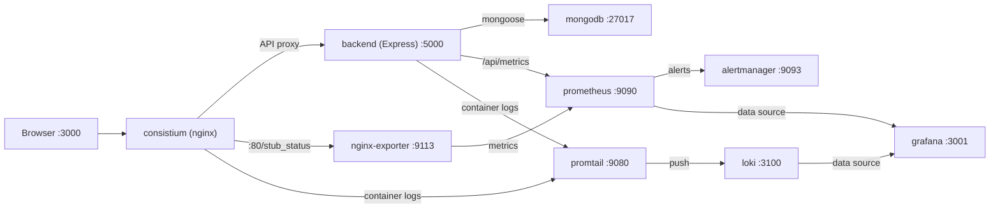
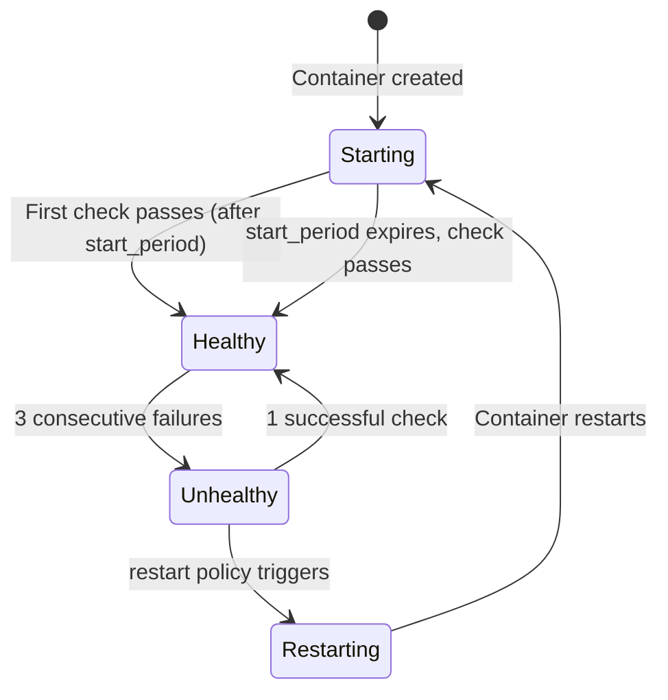
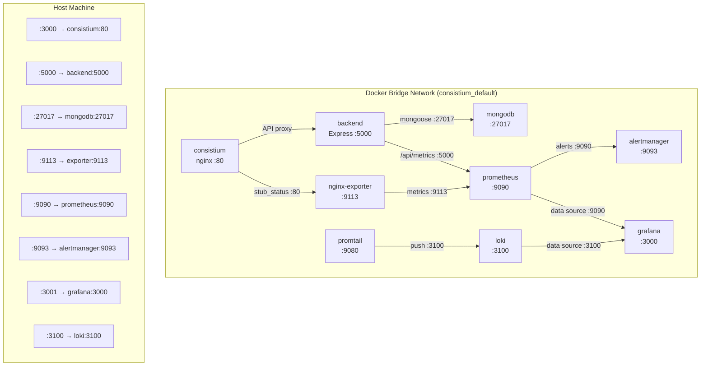

# Docker & Container Setup

Consistium is a full-stack habit tracking application with a **multi-stage Nginx frontend**, a **Node.js/Express backend API**, and **MongoDB** for data persistence. The containerization strategy uses **multi-stage builds** for both frontend and backend images, ensuring production-grade defaults — asset validation, security hardening, non-root execution, and minimal resource footprints. An accompanying **Docker Compose** stack layers on observability through Prometheus metrics, Alertmanager for alert routing, Grafana dashboards, and log aggregation through Loki and Promtail, giving full production visibility without bloating the core application images.

The entire stack — app, backend, database, metrics, alerting, logs, and dashboards — runs on a single machine, making it ideal for development, personal servers, and CI/CD preview environments.

---

## Frontend Dockerfile — Multi-Stage Build

The frontend uses a two-stage build process: validation followed by production image assembly.

```dockerfile
# ── Stage 1: Asset Validation ────────────────────────────────
FROM alpine:3.21 AS validator

WORKDIR /assets

COPY index.html admin.html style.css app.js ./
COPY assets/ ./assets/
COPY nginx.conf ./nginx.conf

RUN set -e && \
    echo "── Validating static assets ──" && \
    for f in index.html admin.html style.css app.js nginx.conf; do \
      if [ ! -s "$f" ]; then \
        echo "ERROR: $f is missing or empty" && exit 1; \
      fi; \
      echo "  ✓ $f ($(wc -c < "$f") bytes)"; \
    done && \
    echo "── All assets validated ──"

# ── Stage 2: Production Image ────────────────────────────────
FROM nginx:1.27-alpine AS production

LABEL org.opencontainers.image.title="Consistium" \
      org.opencontainers.image.description="Consistium Habit Tracker" \
      org.opencontainers.image.authors="Kalpana Pramodya" \
      org.opencontainers.image.source="https://github.com/Kalpanapramodya97/consistium" \
      org.opencontainers.image.licenses="AGPL-3.0"

RUN rm -rf /usr/share/nginx/html/* && \
    apk --no-cache del curl || true && \
    mkdir -p /var/cache/nginx/client_temp \
             /var/cache/nginx/proxy_temp \
             /var/cache/nginx/fastcgi_temp \
             /var/cache/nginx/uwsgi_temp \
             /var/cache/nginx/scgi_temp \
             /tmp/nginx && \
    chown -R 101:101 /var/cache/nginx /tmp/nginx /var/log/nginx && \
    chmod -R 755 /var/cache/nginx /tmp/nginx

COPY --from=validator --chown=101:101 /assets/index.html /usr/share/nginx/html/
COPY --from=validator --chown=101:101 /assets/admin.html /usr/share/nginx/html/
COPY --from=validator --chown=101:101 /assets/style.css /usr/share/nginx/html/
COPY --from=validator --chown=101:101 /assets/app.js /usr/share/nginx/html/
COPY --from=validator --chown=101:101 /assets/assets/ /usr/share/nginx/html/assets/

COPY --chown=101:101 nginx.conf /etc/nginx/nginx.conf

USER 101

EXPOSE 80

HEALTHCHECK --interval=30s --timeout=3s --start-period=5s --retries=3 \
  CMD wget --no-verbose --tries=1 --spider http://localhost:80/ || exit 1

CMD ["nginx", "-g", "daemon off;"]
```

### Stage-by-Stage Explanation

| Stage | Base Image | Purpose |
|-------|-----------|---------|
| **Stage 1: Validator** | `alpine:3.21` | Copies all static files and validates that each required file exists and is non-empty. Catches missing assets at **build time** rather than runtime, preventing broken deployments. |
| **Stage 2: Production** | `nginx:1.27-alpine` | The production image — uses a **pinned** Nginx version (not `latest`), removes default content, creates temp directories for non-root Nginx, sets ownership to UID 101 (nginx user), and runs as non-root. |

### Security Hardening

| Control | Implementation |
|---------|---------------|
| **Non-root execution** | `USER 101` (nginx user) — the container never runs as root |
| **Package reduction** | Removes `curl` to minimize attack surface |
| **Directory ownership** | All writable directories owned by nginx user (UID 101) |
| **OCI Image Labels** | Standard metadata for registry scanners and compliance tools |
| **Health check** | Uses `wget` (available in Alpine) instead of `curl` |
| **Asset validation** | Stage 1 ensures no broken deployments from missing files |

### Why Multi-Stage?

The validator stage serves as a **build-time gate**. Without it, a missing `app.js` would only be discovered when a user hits a 404 in production. With validation, the Docker build itself fails with a clear error message, catching the problem in CI/CD.

---

## Backend Dockerfile — Multi-Stage Build

The backend API uses a two-stage build process: dependency installation followed by a minimal production image.

```dockerfile
# ── Stage 1: Dependency Builder ──────────────────────────────
FROM node:20-alpine AS builder

WORKDIR /usr/src/app

COPY package*.json ./

RUN npm ci --omit=dev && \
    npm cache clean --force

# ── Stage 2: Production Image ────────────────────────────────
FROM node:20-alpine AS production

LABEL org.opencontainers.image.title="Consistium Backend" \
      org.opencontainers.image.description="Consistium Habit Tracker API — Express.js backend"

RUN apk add --no-cache dumb-init

WORKDIR /usr/src/app

ENV NODE_ENV=production \
    PORT=5000

USER node

COPY --from=builder --chown=node:node /usr/src/app/node_modules ./node_modules
COPY --chown=node:node . .

EXPOSE 5000

HEALTHCHECK --interval=30s --timeout=5s --start-period=10s --retries=3 \
  CMD wget --no-verbose --tries=1 --spider http://localhost:5000/api/health || exit 1

ENTRYPOINT ["dumb-init", "--"]
CMD ["node", "server.js"]
```

### Stage-by-Stage Explanation

| Stage | Base Image | Purpose |
|-------|-----------|---------|
| **Stage 1: Builder** | `node:20-alpine` | Installs production dependencies only (`--omit=dev`), excluding test frameworks and dev tools. Cleans npm cache to reduce layer size. |
| **Stage 2: Production** | `node:20-alpine` | Installs `dumb-init` for proper PID 1 signal handling, copies only production `node_modules` from the builder, and runs as the built-in `node` user. |

### Why dumb-init?

Node.js does not handle signals properly when running as PID 1 in a container. Without `dumb-init`:

- `SIGTERM` (sent by `docker stop` and Kubernetes pod termination) is **ignored**, causing a 10-second timeout followed by `SIGKILL`.
- Zombie processes from child processes are not reaped.

`dumb-init` wraps the Node.js process, forwarding signals correctly and reaping zombies, enabling **graceful shutdown** — active requests complete before the process exits.

---

## Nginx Configuration

The custom `nginx.conf` is tuned for a low-traffic, single-instance static site with observability hooks.

### Worker Processes and Connections

```nginx
worker_processes 1;

events {
    worker_connections 128;
}
```

| Directive | Value | Rationale |
|-----------|-------|-----------| 
| `worker_processes` | `1` | A single worker is sufficient for a personal habit tracker. For higher traffic, set to `auto`. |
| `worker_connections` | `128` | Maximum simultaneous connections per worker. Generous for a single user or small team. |

### Gzip Compression

```nginx
gzip on;
gzip_types text/css application/javascript text/html;
gzip_min_length 256;
```

| Directive | Value | Rationale |
|-----------|-------|-----------| 
| `gzip on` | — | Enables on-the-fly gzip compression. Reduces transfer sizes by **60–80%** for text assets. |
| `gzip_types` | CSS, JS, HTML | Binary formats (images) are excluded — they are already compressed. |
| `gzip_min_length` | `256` | Responses under 256 bytes see negligible benefit from compression. |

### Static Asset Caching

```nginx
location ~* \.(css|js|html)$ {
    expires 7d;
    add_header Cache-Control "public, immutable";
}
```

| Directive | Value | Rationale |
|-----------|-------|-----------| 
| `expires` | `7d` | Browsers serve from cache for 7 days without contacting the server. |
| `Cache-Control` | `public, immutable` | `immutable` prevents revalidation requests during the freshness window. Safe because new deployments rebuild the Docker image. |

### Stub Status Endpoint

```nginx
location /stub_status {
    stub_status;
}
```

Exposes real-time Nginx connection metrics, scraped by the nginx-prometheus-exporter sidecar service.

### SPA-Style Routing

```nginx
location / {
    try_files $uri $uri/ /index.html;
}
```

Enables client-side routing: if a user navigates directly to `/settings` or `/dashboard`, Nginx serves `index.html` instead of returning a 404.

---

## Docker Compose Services

The `docker-compose.yml` defines **nine services** forming a complete application-plus-observability stack:



### 1. `consistium` — Frontend Server

```yaml
consistium:
  build: .
  container_name: consistium
  ports:
    - "3000:80"
  restart: unless-stopped
  depends_on:
    - backend
  deploy:
    resources:
      limits:
        cpus: '0.25'
        memory: 32M
      reservations:
        cpus: '0.05'
        memory: 8M
  healthcheck:
    test: ["CMD", "wget", "--no-verbose", "--tries=1", "--spider", "http://localhost:80/"]
    interval: 30s
    timeout: 5s
    retries: 3
```

| Field | Purpose |
|-------|---------|
| `build: .` | Builds from the multi-stage Dockerfile in the project root. |
| `ports: "3000:80"` | Maps host port **3000** to container port **80**. |
| `depends_on: backend` | Ensures the backend API starts before the frontend. |
| `deploy.resources` | Memory limit 32M, CPU limit 0.25 cores (see [Resource Management](#resource-management)). |
| `healthcheck` | Uses `wget` to verify the container is responsive. |

### 2. `backend` — Express API Server

```yaml
backend:
  build: ./backend
  container_name: backend
  ports:
    - "5000:5000"
  environment:
    - MONGODB_URI=mongodb://mongodb:27017/consistium
    - JWT_SECRET=super_secret_consistium_key_change_in_prod
    - PORT=5000
  depends_on:
    - mongodb
  restart: unless-stopped
```

| Field | Purpose |
|-------|---------|
| `build: ./backend` | Builds from the multi-stage Dockerfile in `./backend/`. |
| `ports: "5000:5000"` | Exposes the Express API on port 5000. |
| `environment` | Sets MongoDB connection URI, JWT secret, and server port. |
| `depends_on: mongodb` | Ensures MongoDB starts before the backend attempts to connect. |

> [!WARNING]
> The `JWT_SECRET` in the compose file is a development placeholder. **Always** use a strong, unique secret in production, stored in environment variables or a secret manager.

### 3. `mongodb` — Document Database

```yaml
mongodb:
  image: mongo:6
  container_name: mongodb
  ports:
    - "27017:27017"
  volumes:
    - mongodb_data:/data/db
  restart: unless-stopped
```

| Field | Purpose |
|-------|---------|
| `image: mongo:6` | Official MongoDB 6 image. |
| `ports: "27017:27017"` | Exposes MongoDB for direct access and debugging. |
| `volumes` | Named volume `mongodb_data` persists data across container restarts. |

### 4. `nginx-exporter` — Metrics Bridge

```yaml
nginx-exporter:
  image: nginx/nginx-prometheus-exporter:1.1.0
  container_name: nginx-exporter
  command:
    - -nginx.scrape-uri=http://consistium:80/stub_status
  ports:
    - "9113:9113"
  depends_on:
    - consistium
  restart: unless-stopped
```

| Field | Purpose |
|-------|---------|
| `image` | Official exporter by Nginx Inc. Converts `stub_status` into Prometheus metrics. |
| `command` | Points to the Nginx stub_status endpoint via Docker DNS. |
| `ports: "9113:9113"` | Exposes Prometheus metrics endpoint for debugging. |

### 5. `prometheus` — Time-Series Database & Alert Evaluation

```yaml
prometheus:
  image: prom/prometheus:v2.51.0
  container_name: prometheus
  volumes:
    - ./prometheus/prometheus.yml:/etc/prometheus/prometheus.yml
    - ./prometheus/alerts.yml:/etc/prometheus/alerts.yml
    - ./prometheus/recording-rules.yml:/etc/prometheus/recording-rules.yml
  ports:
    - "9090:9090"
  depends_on:
    - alertmanager
  restart: unless-stopped
  command:
    - '--config.file=/etc/prometheus/prometheus.yml'
    - '--storage.tsdb.path=/prometheus'
    - '--web.console.libraries=/usr/share/prometheus/console_libraries'
    - '--web.console.templates=/usr/share/prometheus/consoles'
    - '--web.enable-lifecycle'
```

| Field | Purpose |
|-------|---------|
| `image` | Pinned to v2.51.0 for reproducibility. |
| `volumes` | Bind-mounts config file, alert rules, and recording rules. |
| `depends_on: alertmanager` | Ensures Alertmanager is available before Prometheus starts sending alerts. |
| `command` | Enables lifecycle API (`POST /-/reload`) for hot-reloading configuration. |

### 6. `alertmanager` — Alert Routing & Email Delivery

```yaml
alertmanager:
  image: prom/alertmanager:v0.27.0
  container_name: alertmanager
  volumes:
    - ./alertmanager/alertmanager.yml:/etc/alertmanager/alertmanager.yml
    - ./alertmanager/templates:/etc/alertmanager/templates
  ports:
    - "9093:9093"
  env_file:
    - .env
  entrypoint:
    - 'sh'
    - '-c'
    - 'sed "s/\$${SMTP_PASSWORD}/$$SMTP_PASSWORD/g" /etc/alertmanager/alertmanager.yml > /tmp/alertmanager.yml && /bin/alertmanager --config.file=/tmp/alertmanager.yml --storage.path=/alertmanager --web.external-url=http://localhost:9093'
  restart: unless-stopped
```

| Field | Purpose |
|-------|---------|
| `image` | Alertmanager v0.27.0 for alert routing, grouping, and notification. |
| `volumes` | Config file and custom HTML email templates. |
| `env_file: .env` | Loads `SMTP_PASSWORD` from the `.env` file for email delivery. |
| `entrypoint` | Substitutes the SMTP password placeholder in the config file at runtime, preventing secrets from being committed to version control. |

### 7. `grafana` — Dashboard & Visualization

```yaml
grafana:
  image: grafana/grafana:10.4.1
  container_name: grafana
  environment:
    - GF_SECURITY_ADMIN_PASSWORD=admin
  ports:
    - "3001:3000"
  volumes:
    - ./grafana/provisioning:/etc/grafana/provisioning
    - ./grafana/dashboards:/var/lib/grafana/dashboards
  restart: unless-stopped
```

| Field | Purpose |
|-------|---------|
| `image` | Pinned Grafana version for dashboard rendering. |
| `environment` | Default admin password. **Change this in production**. |
| `ports: "3001:3000"` | Host port 3001 to avoid conflict with the app on port 3000. |
| `volumes` | Auto-provisioned data sources and dashboards — Grafana starts pre-configured. |

### 8. `loki` — Log Aggregation Engine

```yaml
loki:
  image: grafana/loki:2.9.2
  container_name: loki
  ports:
    - "3100:3100"
  volumes:
    - ./loki/loki-config.yml:/etc/loki/local-config.yaml
  command: -config.file=/etc/loki/local-config.yaml
  restart: unless-stopped
```

| Field | Purpose |
|-------|---------|
| `image` | Loki indexes metadata (labels) rather than log content, making it lightweight. |
| `ports: "3100:3100"` | Exposes the Loki API for LogQL queries. |

### 9. `promtail` — Log Collection Agent

```yaml
promtail:
  image: grafana/promtail:latest
  container_name: promtail
  volumes:
    - ./promtail/promtail-config.yml:/etc/promtail/config.yml
    - /var/lib/docker/containers:/var/lib/docker/containers:ro
    - /var/run/docker.sock:/var/run/docker.sock
  command: -config.file=/etc/promtail/config.yml
  restart: unless-stopped
```

| Field | Purpose |
|-------|---------|
| `image` | Loki's dedicated log shipping agent. |
| `volumes (containers)` | Read-only access to container log files on disk. |
| `volumes (socket)` | Docker socket for automatic container discovery. |

> [!WARNING]
> Mounting the Docker socket (`/var/run/docker.sock`) grants the container access to the Docker API. In production, consider using a read-only Docker socket proxy.

### 10. `ansible-runner` — Automation (One-Shot)

```yaml
ansible-runner:
  build:
    context: .
    dockerfile: ansible/Dockerfile
  container_name: ansible-runner
  volumes:
    - .:/workspace
    - C:/Users/u/Downloads:/downloads
  restart: "no"
```

| Field | Purpose |
|-------|---------|
| `build` | Builds from `ansible/Dockerfile` with the project root as context. |
| `volumes` | Mounts the workspace and a local downloads directory for report output. |
| `restart: "no"` | Runs once and exits — does not restart like long-running services. |

The ansible-runner executes the security report generation playbook, which runs TruffleHog secret scanning, Trivy vulnerability scanning, and generates a branded HTML security report.

---

## Resource Management

```yaml
deploy:
  resources:
    limits:
      cpus: '0.25'
      memory: 32M
    reservations:
      cpus: '0.05'
      memory: 8M
```

### Limits vs. Reservations

| Constraint | Limits | Reservations |
|------------|--------|--------------|
| **Purpose** | Hard ceiling — the container is **throttled** (CPU) or **OOM-killed** (memory) if it exceeds these values. | Soft floor — Docker **guarantees** at least this much is available when scheduling the container. |
| **CPU** | `0.25` = 25% of one core | `0.05` = 5% of one core |
| **Memory** | `32M` = 32 megabytes | `8M` = 8 megabytes |

### Why 32 MB Is Enough

Nginx serving static files is remarkably lightweight:

- The **master process** uses ~2–4 MB of RSS.
- Each **worker process** uses ~4–8 MB under load.
- With `worker_processes 1` and `worker_connections 128`, peak memory rarely exceeds **12–15 MB**.
- The 32 MB limit provides a **2× safety margin** for connection spikes and gzip buffers.

### Why Reserve 8 MB

The 8 MB reservation ensures the container is not starved by noisy neighbors on a shared host. Even under host-wide memory pressure, Docker's memory cgroup guarantees this minimum.

---

## Health Checks

```yaml
healthcheck:
  test: ["CMD", "wget", "--no-verbose", "--tries=1", "--spider", "http://localhost:80/"]
  interval: 30s
  timeout: 5s
  retries: 3
  start_period: 10s
```

### Parameter Breakdown

| Parameter | Value | Meaning |
|-----------|-------|---------|
| `test` | `wget --no-verbose --tries=1 --spider http://localhost:80/` | HTTP HEAD request. Uses `wget` because it is available in Alpine by default; `curl` is not. Exit code 0 = healthy. |
| `interval` | `30s` | Health check frequency. |
| `timeout` | `5s` | Maximum response time before failure. |
| `retries` | `3` | Container marked **unhealthy** after 3 consecutive failures. |
| `start_period` | `10s` | Grace period for container initialization. |

### Health State Lifecycle



When combined with `restart: unless-stopped`, an unhealthy container is automatically restarted by Docker.

---

## Networking

### Docker Compose Default Network

Docker Compose automatically creates a **bridge network** for the stack (e.g., `consistium_default`). All nine services are attached to this network and can communicate using their **service names** as hostnames.



### Service-to-Service Communication

| Source | Destination | Mechanism |
|--------|-------------|-----------|
| `consistium` | `backend:5000` | Nginx reverse proxy. API requests forwarded to the backend service. |
| `backend` | `mongodb:27017` | Mongoose ODM connects via Docker DNS. |
| `nginx-exporter` | `consistium:80/stub_status` | Docker DNS resolution. Traffic stays on the bridge network. |
| `prometheus` | `nginx-exporter:9113/metrics` | Scrape config references the service name. |
| `prometheus` | `backend:5000/api/metrics` | Scrapes prom-client metrics from the Express backend. |
| `prometheus` | `alertmanager:9093` | Sends firing alerts to Alertmanager for routing. |
| `grafana` | `prometheus:9090` | Data source for metrics dashboards. |
| `promtail` | `loki:3100/loki/api/v1/push` | Pushes container log entries to Loki's HTTP API. |
| `grafana` | `loki:3100` | Data source for log visualization. |

### Port Mappings (Host ↔ Container)

| Host Port | Container Port | Service | Purpose |
|-----------|---------------|---------|---------|
| `3000` | `80` | consistium | Application access |
| `5000` | `5000` | backend | API access |
| `27017` | `27017` | mongodb | Database access / debugging |
| `9113` | `9113` | nginx-exporter | Metrics debugging |
| `9090` | `9090` | prometheus | PromQL queries & UI |
| `9093` | `9093` | alertmanager | Alert management UI |
| `3001` | `3000` | grafana | Dashboard access |
| `3100` | `3100` | loki | Log aggregation API |
| — | `9080` | promtail | Internal (no host port) |
| — | — | ansible-runner | One-shot task (no ports) |

> [!NOTE]
> Internal container-to-container traffic uses the **container ports** (e.g., `80`, `5000`, `27017`). Host port mappings are only relevant for external access from the host machine or network.

---

## Quick Start Commands

### Starting the Stack

```bash
# Build and start all services in detached mode
docker compose up -d --build

# Start without rebuilding (uses cached images)
docker compose up -d
```

### Stopping the Stack

```bash
# Stop and remove containers, networks
docker compose down

# Stop and remove containers, networks, AND volumes (clears MongoDB data)
docker compose down -v
```

### Viewing Logs

```bash
# Follow logs for all services
docker compose logs -f

# Follow logs for a specific service
docker compose logs -f backend

# Show last 100 lines
docker compose logs --tail=100
```

### Rebuilding After Code Changes

```bash
# Rebuild only the frontend image and restart
docker compose up -d --build consistium

# Rebuild only the backend image and restart
docker compose up -d --build backend

# Force a full rebuild (no cache)
docker compose build --no-cache
docker compose up -d
```

### Inspecting Health Status

```bash
# Check health status of all containers
docker compose ps

# Detailed health check output for the app
docker inspect --format='{{json .State.Health}}' consistium

# Backend health check
docker inspect --format='{{json .State.Health}}' backend
```

### Running the Ansible Security Report

```bash
# Run the ansible-runner service (one-shot)
docker compose run --rm ansible-runner ansible-playbook -i inventory.yml run-security-report.yml
```

### Accessing Services

| Service | URL |
|---------|-----|
| Consistium App | [http://localhost:3000](http://localhost:3000) |
| Backend API | [http://localhost:5000/api/health](http://localhost:5000/api/health) |
| Backend Metrics | [http://localhost:5000/api/metrics](http://localhost:5000/api/metrics) |
| Prometheus UI | [http://localhost:9090](http://localhost:9090) |
| Alertmanager UI | [http://localhost:9093](http://localhost:9093) |
| Grafana Dashboard | [http://localhost:3001](http://localhost:3001) |
| Nginx Metrics (raw) | [http://localhost:9113/metrics](http://localhost:9113/metrics) |
| Loki API | [http://localhost:3100](http://localhost:3100) |

### Resource Usage

```bash
# Real-time resource usage for all containers
docker stats

# One-shot snapshot (no streaming)
docker stats --no-stream
```

---

## Image Size & Optimization

### Frontend Image — nginx:1.27-alpine

| Image Variant | Compressed Size | Uncompressed Size |
|---------------|-----------------|-------------------|
| `nginx:latest` (Debian) | ~60 MB | ~140 MB |
| `nginx:1.27-alpine` | ~15 MB | ~40 MB |

The Alpine variant is **~70% smaller** than the Debian-based default. The final Consistium image adds only static files (< 100 KB) on top of the base image.

### Backend Image — node:20-alpine

| Image Variant | Compressed Size | Uncompressed Size |
|---------------|-----------------|-------------------|
| `node:20` (Debian) | ~350 MB | ~1 GB |
| `node:20-alpine` | ~50 MB | ~130 MB |

The Alpine variant is **~85% smaller**. The multi-stage build further reduces the final image by excluding devDependencies (Jest, Nodemon, Supertest) and build tools.

### Optimization Techniques Used

| Technique | Applied To | Benefit |
|-----------|-----------|---------|
| **Multi-stage builds** | Frontend + Backend | Build tools and validation logic excluded from production images |
| **Production-only deps** | Backend (`npm ci --omit=dev`) | Excludes Jest, Nodemon, Supertest from the final image |
| **Alpine base images** | Both | 70–85% smaller than Debian equivalents |
| **`.dockerignore`** | Both | Prevents `.git/`, `docs/`, `node_modules/` from entering build context |
| **Pinned versions** | Both (`nginx:1.27-alpine`, `node:20-alpine`) | Prevents supply-chain drift from `latest` tag mutations |
| **OCI Labels** | Both | Standard metadata for registry compliance |
| **Non-root execution** | Both | Reduced privilege for security |
