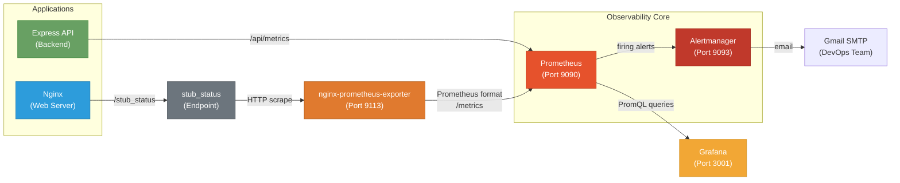

# Monitoring & Observability

Even for seemingly simple applications, observability is not a luxury — it is a necessity. Without visibility into how your application behaves in production, you are flying blind. Monitoring enables you to detect issues before users do, understand traffic patterns, plan capacity, and diagnose incidents quickly. Consistium uses a powerful observability stack built on industry-standard open-source tools: **Nginx**, **Node.js (prom-client)**, **Prometheus**, **Alertmanager**, and **Grafana**. This stack provides real-time metrics collection, persistent time-series storage, alert routing via email, and rich visual dashboards.

---

## Data Flow

The following diagram illustrates how metrics flow from the applications through the monitoring pipeline to the Grafana dashboard and email notifications:



**In plain terms:**

1. Nginx exposes a lightweight status page at `/stub_status`.
2. The nginx-prometheus-exporter scrapes that page and translates it into Prometheus-compatible metrics.
3. The Express backend exposes application-level metrics via `prom-client` at `/api/metrics`.
4. Prometheus pulls metrics from both the Nginx exporter and the Backend every 15 seconds.
5. Prometheus evaluates alerting rules. If an alert triggers, it sends it to Alertmanager.
6. Alertmanager groups, dedupes, and routes the alerts to email receivers via Gmail SMTP.
7. Grafana connects to Prometheus and renders the data as interactive dashboards.

---

## Architecture

### Backend Metrics (`prom-client`)

The Node.js Express backend is instrumented using the `prom-client` library. This provides built-in Node.js metrics (memory, CPU, event loop lag) and custom Express metrics (HTTP request duration, status codes).
These metrics are exposed at the `/api/metrics` endpoint.

### Nginx (`stub_status` Module)

Nginx's `stub_status` module is a built-in feature that exposes basic connection and request statistics via a simple HTTP endpoint. 

### nginx-prometheus-exporter

| Property | Value |
|----------|-------|
| **Image** | `nginx/nginx-prometheus-exporter:1.1.0` |
| **Port** | `9113` |
| **Role** | Metrics translator |

The nginx-prometheus-exporter connects to the `stub_status` endpoint and re-exposes the data in Prometheus exposition format at `/metrics` on port `9113`.

### Prometheus

| Property | Value |
|----------|-------|
| **Image** | `prom/prometheus:v2.51.0` |
| **Port** | `9090` |
| **Role** | Metrics collection, storage, and rule evaluation |

Prometheus operates on a **pull model** — it actively scrapes configured targets at regular intervals. It also evaluates alerting and recording rules, pushing firing alerts to Alertmanager.

### Alertmanager

| Property | Value |
|----------|-------|
| **Image** | `prom/alertmanager:v0.27.0` |
| **Port** | `9093` |
| **Role** | Alert routing & email delivery |

Alertmanager handles alerts sent by Prometheus. It takes care of deduplicating, grouping, and routing them to the correct receiver integration such as email.

### Grafana

| Property | Value |
|----------|-------|
| **Image** | `grafana/grafana:10.4.1` |
| **Port** | `3001` |
| **Role** | Visualization & dashboarding |

Grafana provides a rich web UI. In Consistium, data sources and dashboards are **auto-provisioned** using volume mounts, meaning Grafana starts fully configured without manual setup.

---

## Prometheus Configuration

Prometheus is configured via `prometheus.yml`. 

```yaml
global:
  scrape_interval: 15s
  evaluation_interval: 15s
  external_labels:
    monitor: 'consistium'
    environment: 'production'

alerting:
  alertmanagers:
    - static_configs:
        - targets:
            - alertmanager:9093

rule_files:
  - /etc/prometheus/alerts.yml
  - /etc/prometheus/recording-rules.yml

scrape_configs:
  - job_name: 'nginx'
    static_configs:
      - targets: ['nginx-exporter:9113']
  - job_name: 'prometheus'
    static_configs:
      - targets: ['localhost:9090']
  - job_name: 'alertmanager'
    static_configs:
      - targets: ['alertmanager:9093']
  - job_name: 'backend'
    static_configs:
      - targets: ['backend:5000']
    metrics_path: /api/metrics
```

### Rule Files
- `alerts.yml`: Contains alerting rules (e.g., High Active Connections, Backend Down, High Error Rate).
- `recording-rules.yml`: Pre-computes expensive queries (e.g., request rates, SLO aggregations) and stores them as new metrics.

---

## Alertmanager Configuration

Alertmanager groups alerts by `alertname` and `job` to prevent alert storms and routes them based on severity.

### Routing Tree

- **Critical Alerts**: Routed to `devops-email-critical` immediately (0s group wait), repeats every 1h.
- **Security Alerts**: Routed to `security-email`, repeats every 30m.
- **Warning Alerts**: Routed to `devops-email`, grouped for 1m, repeats every 6h.
- **Watchdog**: Heartbeat alert routed to `watchdog-email` once a day to ensure the monitoring pipeline is functioning.

### Inhibition Rules

Alertmanager suppresses `warning` alerts when a `critical` alert is already firing for the same job and instance, reducing noise during an outage.

### Email Templates

Alertmanager uses custom HTML templates (`alertmanager/templates/email.tmpl`) to format alert emails beautifully, providing context and actionable links.

---

## Grafana Auto-Provisioning

Grafana is configured using **provisioning** to eliminate manual setup.

### Data Sources
Configured in `grafana/provisioning/datasources/`:
- **Prometheus**: Connects to `http://prometheus:9090`.
- **Loki**: Connects to `http://loki:3100`.

### Dashboards
Configured in `grafana/provisioning/dashboards/`:
- Grafana automatically loads JSON dashboard models from `grafana/dashboards/`, such as Nginx metrics, Backend performance, and Alertmanager status.

---

## Accessing the Stack

| Service | URL | Port | Purpose |
|---------|-----|------|---------|
| **Nginx** | [http://localhost](http://localhost) | `80` | Main application web server |
| **Backend API** | [http://localhost:5000/api/health](http://localhost:5000/api/health) | `5000` | Application backend |
| **Prometheus** | [http://localhost:9090](http://localhost:9090) | `9090` | Metrics storage, querying, and alerting rules |
| **Alertmanager**| [http://localhost:9093](http://localhost:9093) | `9093` | Alert routing and status |
| **Grafana** | [http://localhost:3001](http://localhost:3001) | `3001` | Dashboards and visualization |

> [!CAUTION]
> In a production deployment, **do not** expose Prometheus (`9090`), Alertmanager (`9093`), the nginx-exporter (`9113`), or the `/stub_status` endpoint to the public internet. Use firewall rules, reverse proxies with authentication, or bind these services only to internal network interfaces.
