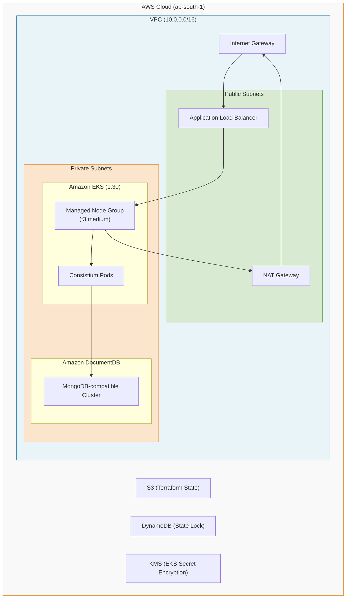

# Terraform Infrastructure as Code

Consistium uses **Terraform** to declaratively provision, manage, and scale its AWS production infrastructure. The infrastructure is defined using modular, reusable components for networking, compute, and databases.

## Architecture

The AWS environment is deployed in a Virtual Private Cloud (VPC) spanning multiple Availability Zones, ensuring high availability and fault tolerance.



---

## Directory Structure

```text
terraform/
├── main.tf                          # Root module — orchestrates all child modules
├── variables.tf                     # Input variables with validations
├── outputs.tf                       # Output values (endpoints, instructions)
├── versions.tf                      # Provider & Terraform version constraints
├── backend.tf                       # S3 remote state + DynamoDB locking
├── locals.tf                        # Computed values & tagging strategy
├── environments/
│   ├── dev.tfvars                   # Dev: cost-optimized, minimal resources
│   ├── staging.tfvars               # Staging: mirrors prod at reduced scale
│   └── prod.tfvars                  # Prod: full HA, multi-AZ, large instances
└── modules/
    ├── vpc/                         # VPC, subnets, NAT, flow logs
    ├── eks/                         # EKS cluster, node groups, IRSA, KMS
    └── documentdb/                  # DocumentDB cluster, backups, alarms
```

---

## Modules

The infrastructure is broken down into three core modules:

### 1. VPC Module
Creates a secure networking foundation with 2 public and 2 private subnets across 2 Availability Zones. It provisions an Internet Gateway for inbound traffic, a NAT Gateway for outbound traffic from private subnets, and enables VPC Flow Logs for auditing.

### 2. EKS Module
Provisions a managed Amazon Elastic Kubernetes Service (EKS) cluster running K8s v1.30.
- **Node Groups**: Managed node groups automatically scaled based on demand.
- **IRSA**: IAM Roles for Service Accounts allows assigning fine-grained IAM permissions directly to K8s Pods, avoiding broad node-level permissions.
- **KMS**: Kubernetes secrets (like JWT secrets) are encrypted at rest in `etcd` using an AWS KMS key.

### 3. DocumentDB Module
Provisions Amazon DocumentDB, a fully managed, MongoDB-compatible database.
- Deployed exclusively in private subnets with strict security groups.
- TLS encryption enforced in transit.
- Storage encrypted at rest.
- Automated daily backups and retention.
- Deletion protection prevents accidental `terraform destroy`.

---

## Multi-Environment Strategy

A single Terraform codebase supports multiple environments via `.tfvars` files:

| Feature | Dev | Staging | Production |
|---|---|---|---|
| EKS Nodes | 1× `t3.small` | 2× `t3.medium` | 3× `t3.large` |
| DB Instances | 1× `db.t3.medium` | 2× `db.t3.medium` | 3× `db.r6g.large` |
| HA | Single AZ | Multi AZ | Multi AZ |
| Cost Est. | ~$90 / mo | ~$180 / mo | ~$500 / mo |

---

## State Management

Terraform state is stored securely using an **S3 backend** with **DynamoDB locking**.

- **S3 Bucket**: Stores the `terraform.tfstate` file, tracking resource mappings. Versioning is enabled to recover from accidental state corruption.
- **DynamoDB Table**: Provides state locking to prevent concurrent CI/CD runs or developers from applying conflicting changes simultaneously.

---

## Usage

### Prerequisites
- [Terraform](https://developer.hashicorp.com/terraform/install) >= 1.5.0
- Valid AWS credentials configured (e.g., `aws configure` or `AWS_ACCESS_KEY_ID`).

### Common Commands

```bash
# 1. Initialize providers and remote backend
terraform init

# 2. Format code and validate syntax
terraform fmt -recursive
terraform validate

# 3. Plan changes (e.g., against Dev environment)
terraform plan -var-file="environments/dev.tfvars" -var="docdb_master_password=SuperSecret123!"

# 4. Apply changes
terraform apply -var-file="environments/dev.tfvars" -var="docdb_master_password=SuperSecret123!"
```

---

## Security & FinOps

### Security Features
- **Least Privilege Network**: All compute and data tier resources reside in private subnets without public IP addresses. Inbound traffic must pass through the ALB.
- **Encryption Everywhere**: Data is encrypted at rest (EBS, DocumentDB, S3) and in transit (TLS).
- **No Hardcoded Secrets**: Sensitive data (like DB passwords) are injected at runtime via environment variables (`TF_VAR_docdb_master_password`) and never committed to source control.

### FinOps (Infracost)
The GitHub Actions CI/CD pipeline runs `infracost` automatically on every Pull Request, commenting the expected cost difference before any changes are merged. This shifts cost management left into the developer workflow.
