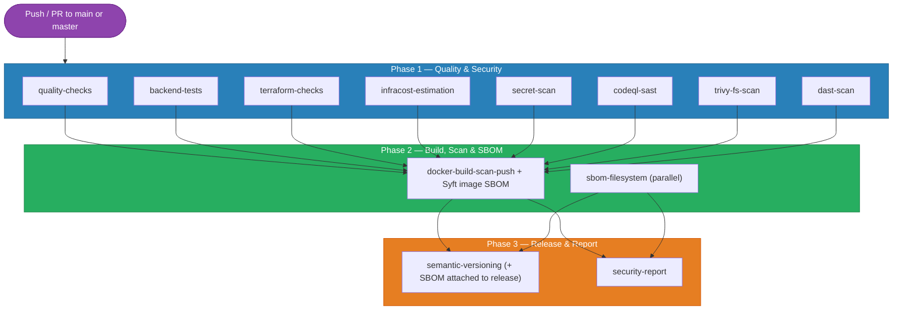

# Unified CI/CD & DevSecOps Pipeline

Consistium uses a single, unified pipeline defined in [`.github/workflows/ci-cd.yml`](.github/workflows/ci-cd.yml) that automatically builds, tests, secures, and releases the application on every push and pull request. This pipeline orchestrates **12 discrete jobs across 3 phases**, implementing a robust "Shift-Left" security posture.

---

## Pipeline Architecture

The pipeline uses a "fan-out, fan-in" dependency graph. Eight highly parallelized quality and security checks must all pass before the Docker image is built. Finally, versioning and reporting are generated.



---

## Pipeline Triggers and Concurrency

The pipeline activates on two event types:

| Event | Branches | Purpose |
|-------|----------|---------|
| `push` | `main`, `master` | Mainline integration and deployment builds. |
| `pull_request` | `main`, `master` | Verifies proposed changes before merging. |

### Concurrency Control

```yaml
concurrency:
  group: ${{ github.workflow }}-${{ github.ref }}
  cancel-in-progress: true
```
To optimize GitHub Actions minute usage, if a developer pushes a new commit while a previous run for the same branch is still executing, the older run is **automatically canceled**.

---

## Phase 1: Quality & Security Checks

These jobs run completely in parallel, completing in minutes to provide immediate developer feedback.

### 1. Code Quality (`quality-checks`)
- **HTML Linting**: Uses `htmlhint` to check syntax. Uses `|| true` so minor styling issues do not fail the build.
- **Dockerfile Linting**: Uses `hadolint/hadolint-action` to enforce Docker best practices.

### 2. Backend Tests (`backend-tests`)
- Configures Node.js v20.
- Installs dependencies using `npm ci`.
- Runs Jest test suites with `npm test`.

### 3. Terraform Validation (`terraform-checks`)
- Runs `terraform fmt -check` to enforce HCL styling.
- Runs `terraform validate` to verify module syntax.
- Runs **TFLint** against the `terraform/` directory.

### 4. FinOps Estimation (`infracost-estimation`)
- Runs Infracost against the Terraform directory.
- Estimates the monthly cost impact of infrastructure changes.
- Exports a JSON breakdown for the final security report.

### 5. Secret Scanning (`secret-scan`)
- Runs **TruffleHog** via Docker against the entire commit history (`fetch-depth: 0`).
- Looks for leaked credentials, API keys, and JWT secrets.
- Uses `continue-on-error: true` but outputs JSON for the final report.

### 6. SAST (`codeql-sast`)
- Initializes GitHub CodeQL for JavaScript.
- Performs static analysis of the source code for vulnerabilities (e.g., injections, XSS).
- Uploads SARIF results to GitHub's Security tab and saves for the final report.

### 7. Dependency Scanning (`trivy-fs-scan`)
- Uses Aqua Trivy to scan the local filesystem (`package.json`, `package-lock.json`).
- Targets CRITICAL and HIGH vulnerabilities only.
- Generates JSON for the final report.

### 8. DAST (`dast-scan`)
- Starts the application stack using `docker compose up -d`.
- Waits for the application to report healthy status.
- Runs OWASP ZAP baseline scan against the running container network.
- Identifies runtime vulnerabilities like missing headers and misconfigurations.

---

## Phase 2: Build, Scan & SBOM

This phase executes only if **all** Phase 1 jobs succeed.

### 9. Build, Scan & Push (`docker-build-scan-push`)
- Configures Docker Buildx for multi-architecture support.
- Builds the `consistium` image and loads it into the local Docker daemon.
- **Trivy Image Scan**: Scans the compiled image for OS-level CVEs (e.g., Alpine packages).
- **Syft SBOM (Image)**: Generates two SBOM files from the Docker image in **CycloneDX JSON** and **SPDX JSON** formats. Uploaded as 90-day pipeline artifacts.
- Pushes the image to **GitHub Container Registry (GHCR)** automatically, tagged with the commit SHA and `latest`.

### 9b. Filesystem SBOM (`sbom-filesystem`) *(runs in parallel)*
- Installs backend npm dependencies for accurate package resolution.
- Uses **Anchore Syft v1.4.1** to generate SBOMs from the project filesystem.
- Produces **CycloneDX JSON** and **SPDX JSON** — covering all npm packages, OS packages, and source files.
- Uploaded as 90-day pipeline artifacts.

---

## Phase 3: Release & Reporting

### 10a. Semantic Versioning (`semantic-versioning`)
*(Only runs on `push` to `main`/`master`)*
- Automatically calculates the next semantic version tag (e.g., v1.2.3) based on commit history.
- Downloads the 4 SBOM files generated in Phase 2 and attaches them to the GitHub Release as downloadable assets:
  - `sbom-image-cyclonedx.json`, `sbom-image-spdx.json` (Docker image)
  - `sbom-fs-cyclonedx.json`, `sbom-fs-spdx.json` (Filesystem/npm)
- Generates an HTML Release Document and emails it to the DevOps team using `dawidd6/action-send-mail`.

### 10b. Security Report (`security-report`)
*(Always runs, even if earlier jobs fail)*
- Downloads JSON artifacts from TruffleHog, CodeQL, Trivy (FS & Image), Infracost, and **both SBOM scans**.
- Executes `security/generate-report.sh`.
- Combines all data into a beautiful, branded HTML **DevSecOps & FinOps Report**.
- Emails the final report to the DevOps team.

---

## Configuration Reference

| Component | Action / Tool Used | Config Location |
|-----------|--------------------|-----------------|
| HTML Linting | `htmlhint` | Workflow inline |
| Docker Linting | `hadolint/hadolint-action@v3` | `.hadolint.yaml` |
| Node.js Setup | `actions/setup-node@v4` | Workflow inline |
| Terraform | `hashicorp/setup-terraform@v3` | Workflow inline |
| TFLint | `terraform-linters/setup-tflint@v4` | `.tflint.hcl` |
| Infracost | `infracost/actions/setup@v3` | Workflow inline |
| CodeQL | `github/codeql-action` | Workflow inline |
| Secret Scan | `trufflesecurity/trufflehog` | `.trufflehog-exclude` |
| Vulnerability | `aquasecurity/trivy-action` | Workflow inline |
| DAST | `zaproxy/action-baseline` | Workflow inline |
| Build System | `docker/build-push-action` | `Dockerfile` |
| **SBOM** | **`anchore/syft` v1.4.1** | **Workflow inline** |
| Versioning | `mathieudutour/github-tag-action` | Workflow inline |
| **Rate Limiting** | **`express-rate-limit` v7.4.0** | **`backend/middleware/rateLimiter.js`** |
| **NoSQL Sanitize** | **`express-mongo-sanitize` v2.2.0** | **`backend/server.js`** |
